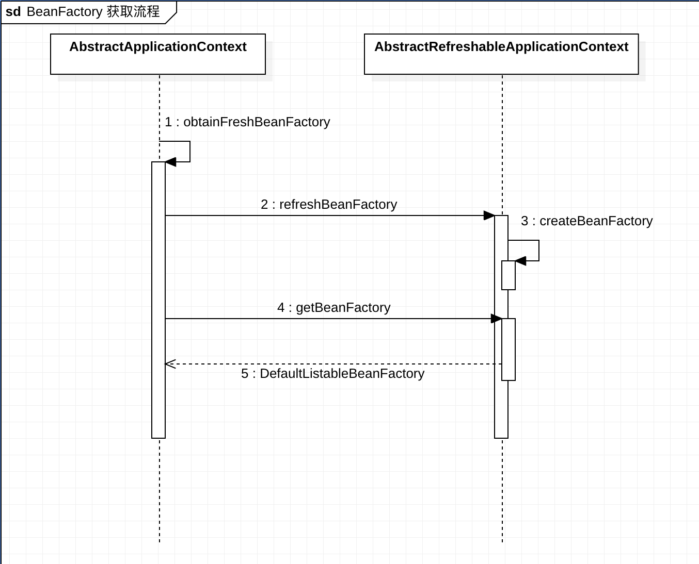

- 使用 ClassPathXmlApplicationContext 作为入口，也就是由 xml 配置参与
	- {:height 450, :width 547}
- 使用 ((5422c2f9-b7a6-4717-8738-9749087b7338)) 最为入口，也就是纯注解配置
	- 不是使用 AbstractRefreshableApplicationContext 来创建 BeanFactory，而是使用 [[GenericApplicationContext]]