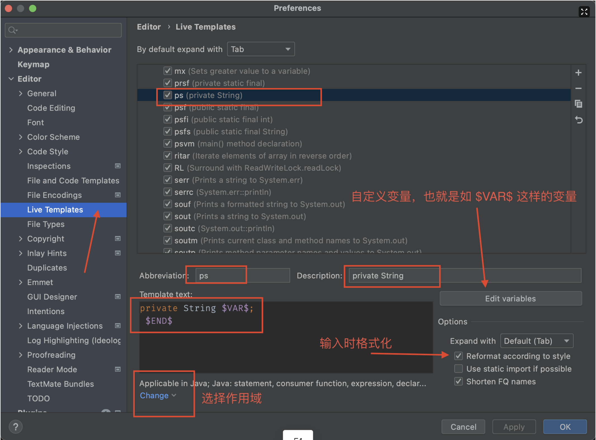

- [[快捷键]]
- 小技巧
  collapsed:: true
	- tf
	- postfix completion (后缀自动完成 )
	  collapsed:: true
		- `.sout`
		- `.soutv`
		  ```java
		  // before
		  item.soutv
		  // after
		  System.out.println("item = " + item);
		  ```
		- `.for` `.fori`
		- `.var`
		- `.null` `.nn`
		  ```java
		  // before
		  obj.null
		  // after
		  if(obj == null){
		    ...
		  }
		  
		  //.nn (not null)
		  if(obj != null){
		    ...
		  }
		  ```
		- .case
		  ```java
		  123.cast
		  ((float) 123)
		  ```
		- .return
		  ```java
		  "hello".return
		  // after
		  return "hello";
		  ```
	- Live Templates(动态模版)
		- 常用
			- fori
			- sout
			- ifn
			- main 自定义
			- ps 自定义
		- 自定义
			- {:height 495, :width 640}
		- [参考](https://www.jetbrains.com/help/idea/template-variables.html#predefined_functions)
- 问题
	- [[MyBatis]] mapper.xml 无法识别字段
		- 搜索 `sql Resolution Scopes` 选择数据库