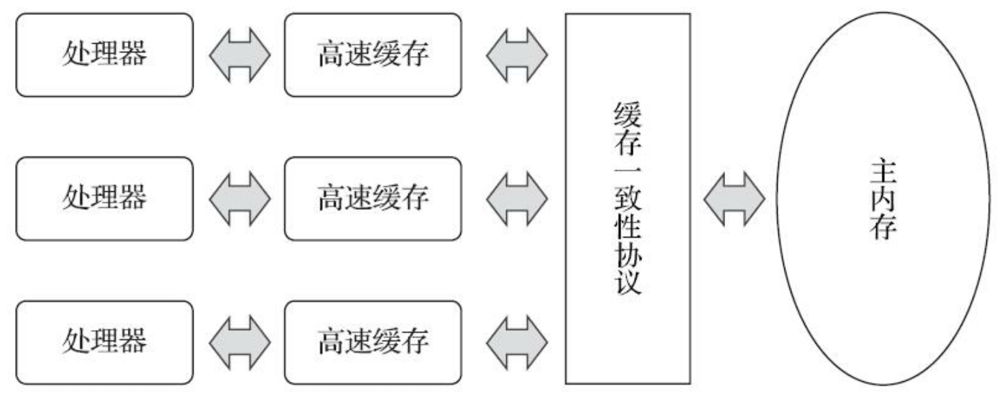
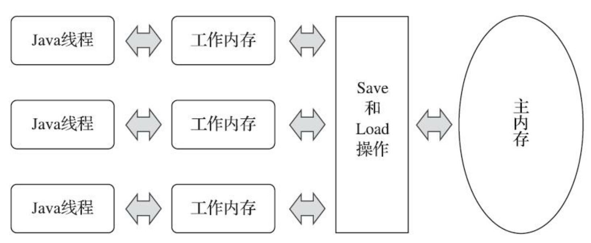
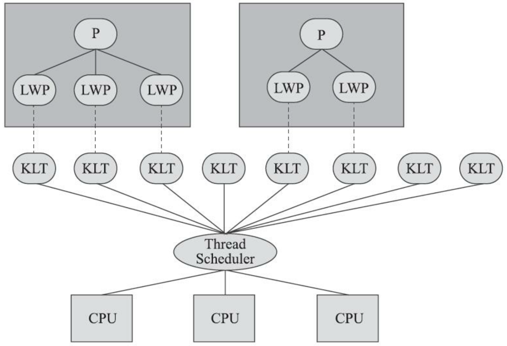
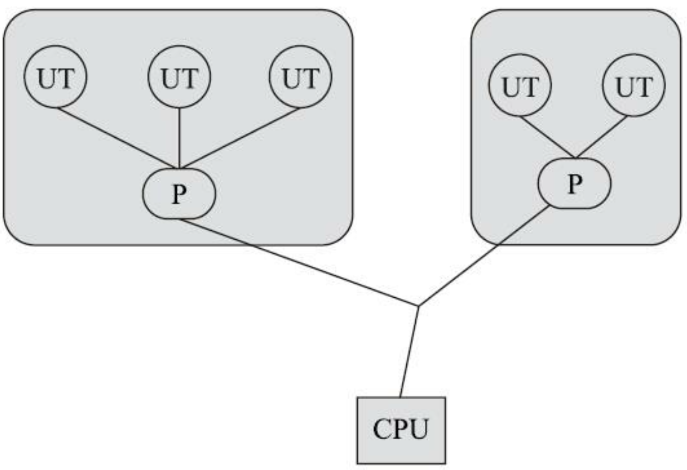
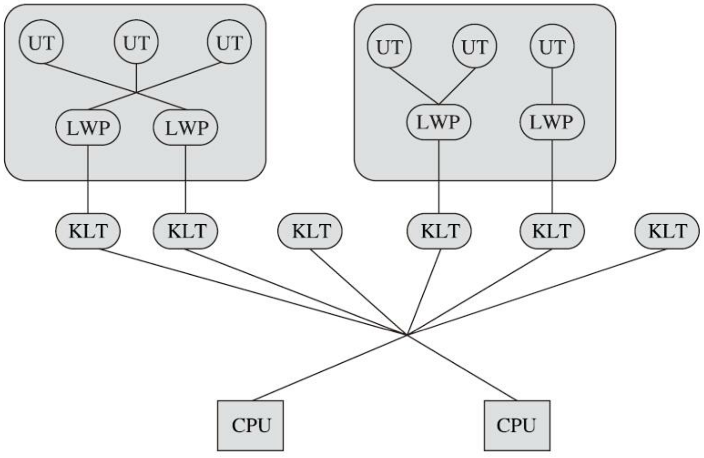
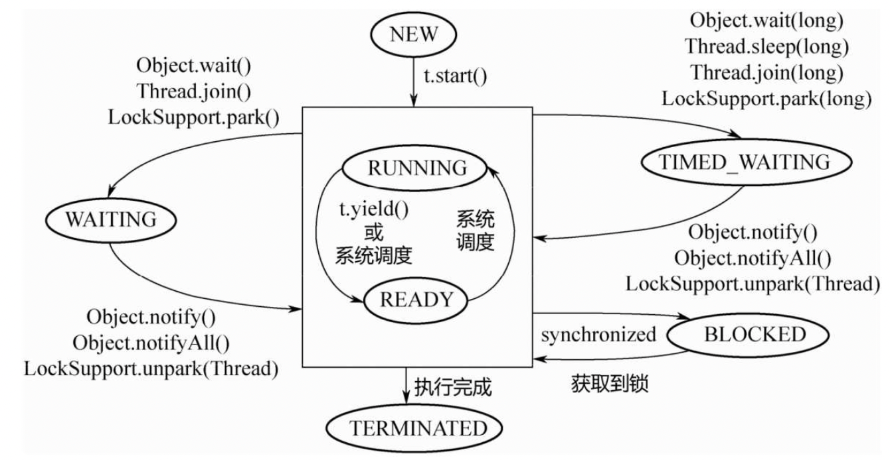

- Java 内存模型
	- 目的
		-
		  1. 来屏蔽各种硬件和操作系统的内存访问差异，以实现让Java程序在各种平台下都能达到一致的内存访问效果
		-
		  2. 解决主内存（Java 概念上的，不过一般两者却是差不多）和线程工作内存之间的一致性
	- 和物理内存的类比
		- 物理内存逻辑
		  {:height 219, :width 446}
		- Java 内存模型的逻辑
		  {:height 189, :width 445}
	- 主内存和工作内存的交互操作
	  collapsed:: true
		- 八种操作
			- > 要求原子性，非 volatile 的 double，long 存在例外 ((61ace167-2d71-418d-bc12-70e26b189672))
			- lock 和 unlock：作用于主内存的变量，加锁和解锁线程独占状态
			- read 和 load：从主内存传送变量到工作内存，把传送过来的变量放入工作内存的变量副本中
			- use：将工作内存的变量传递给执行引擎
			- assign：赋值修改，把一个从执行引擎接受的值赋给工作内存的变量
			- store 和 write：工作内存传送到主内存，把传送过来的变量放入主内存变量中
		- 操作规则
			- > 这里的 lock 和汇编中的 lock 命令不是一码事，不要混淆
			- 1. read/load,store/wirte 捆绑销售，但是允许中间插入其他操作
			- 2. assign 不允许后悔，只要 assign，就必须 store/wirte
			- 3. 无修改不允许 store/wirte
			- 4. use/store 之前，必须先 assign 和 load，不允许在工作内存中直接使用一个未被初始化(load或 assign ) 的 变 量
			- 5. lock/unlock 允许重入锁
			- 6. lock/unlock 成对顺序执行，不允许直接 unlock
			- 7. lock 之前，需要重新对变量 load 或 assign 初始化值
			-
			  8. unlock 之前，必须先 store/wirte
		- voltile 变量的特殊规则
			- 为保证内存可见性
				- load 和 use 相关联，捆绑销售，load 之后必须是 use，use 之前必须是 load
				- assign 和 store 相关联，捆绑销售
			- 防止重排序
				- 假定： 
				  对变量 T -> 
				  A：use 或 assign
				  F：load 或 store
				  P：read 或 write
				  对变量 W ->
				  B：use 或 assign
				  G：load 或 store
				  Q：read 或 write
				  那么：如果 A 先于 B，则 P 须先于 Q
		- long 和 double 变量的特殊规则
		  id:: 61ace167-2d71-418d-bc12-70e26b189672
		  collapsed:: true
			- 总结：只有 long 在 32 位 Java 虚拟机中会出现非原子性访问，可以使用参数（jdk9+）`-XX:+AlwaysAtomicAccesses` 来防止这种非原子性访问
			- 允许虚拟机实现自行选择是否要保证 64 位数据类型的 load 、 store 、 read 和 write 这四个操 作的原子性 ， 这就是所谓的 “long 和 double 的非原子性协定” (Non-Atomic Treatment of double and long Variables)
			- 目前主流平台下商用的**64位Java虚拟机**中并**不会出现非原子性访问**行为
			- 对于32位的Java虚拟机，譬如比较常用的32 位x86平台下的HotSpot虚拟机，对long类型的数据确实存在非原子性访问的风险
			- 而针对double类型，由于现代中央处 理器中一般都包含专门用于处理浮点数据的浮点运算器(Floating Point Unit，FPU)，用来专门处理 单、双精度的浮点数据，所以哪怕是32位虚拟机中通常也不会出现非原子性访问的问题
			- 从JDK 9起， HotSpot 增加了一个实验性的参数`-XX:+AlwaysAtomicAccesses`(这是JEP 188对Java内存模型更新的 一部分内容)来约束虚拟机对所有数据类型进行原子性的访问
	- 特征：原子性、可见性和有序性
	  collapsed:: true
		- 原子性
			- 原子性变量操作包括 read、 load、assign、use、store 和 write 这六个，基本数据类型的访问、读写都是具备原子性的
			- lock/unlock 来保证更大范围的原子性，尽管虚拟机未把 lock 和 unlock 操作直接开放给用户使用，但是却提供了更高层次的字节码指令 monitorenter 和 monitorexit 来隐式地使用这两个操作。这两个字节码指令反映到 Java 代码中就是同步块——synchronized 关键字，因此在 synchronized 块之间的操作也具备原子性
		- 可见性
			- 指当一个线程修改了共享变量的值时，其他线程能够立即得知这个修改
			- volatile，synchronized，final
				- volatile的特殊规则保证了新值能立即同步到主内存，以及每次使用前立即从主内存刷新
				- 同步块的可见性是由“对一个变量执行unlock操作之前，必须先把此变量同步回主内存中(执行store、write操 作)”这条规则获得的
				- final 则在初始化完成后，其他线程旧能立刻看到 final 字段的值，当然前提是不能有[[this 引用逃逸]]
		- 有序性
			- 如果在本线程内观察，所有的操作都是有序的;如果在一个线程中观察另一个线程， 所有的操作都是无序的
			- volatile 和 synchronized 两个关键字来保证线程之间操作的有序性
	- 先行发生原则（Happens-Before）: 只要满足就能保证线程安全
	  collapsed:: true
		- > 可以用来判定程序是否有线程安全问题，是否具有顺序性
		- Java内存模型下一些“天然的”先行发生关系
			- 程序次序规则：同一线程内的串行化
			- 管程锁定规则：一个 unlock 操作先行发生于后面对同一个锁的 lock 操作
			- volatile 变量规则：对一个volatile变量的写操作先行发生于后面对这个变量 的读操作
			- 线程启动规则：Thread对象的start()方法先行发生于此线程的每一个动作
			- 线程终止规则：线程中的所有操作都先行发生于对此线程的终止检测，我们可以通过T hread::join() 方法是否结束、Thread::isAlive() 的返回值等手段检测线程是否已经终止执行。
			- 线程中断规则：对线程 interrupt() 方法的调用先行发生于被中断线程的代码检测到中断事件的发生，可以通过 Thread::interrupted() 方法检测到是否有中断发生
			- 对象终结规则：一个对象的初始化完成(构造函数执行结束)先行发生于它的 finalize() 方法的开始。
			- 传递性：如果操作A先行发生于操作B，操作B先行发生于操作C，那就可以得出操作A先行发生于操作C的结论
- Java 和 线程
	- 3 种线程的实现
		- 内核线程（Kernel-Level Thread，KLT）实现： 1: 1 实现
			- {:height 241, :width 341}
			- 使用内核线程作为支持来实现程序线程
			- 但是程序一般不会直接使用内核线程，而是使用内核线程的一种高级接口——轻量级进程(Light Weight Process，LWP)
			- 这种轻量级进程与内核线程之间 1:1 的关系称为一对一的线程模型
			- 优缺点
				- 优点：由于内核线程的支持，每个轻量级进程都成为一个独立的调度单元，即使其中某一个轻量级进程 在系统调用中被阻塞了，也不会影响整个进程继续工作
				- 缺点：由于是基于内核线程实现的，所以各种线程操作，如创建、析构及同步，都需要进行系统调用。而系统调 用的代价相对较高，需要在用户态(User Mode)和内核态(Kernel Mode)中来回切换。其次，每个 轻量级进程都需要有一个内核线程的支持，因此轻量级进程要消耗一定的内核资源(如内核线程的栈 空间)，因此一个系统支持轻量级进程的数量是有限的
		- 用户线程（UT）的实现：1: N 实现
			- {:height 226, :width 316}
			- 广义上来讲，一个线程只要不是内核线程，都可以认为是用户线程(User Thread，UT)的一种，因此从这个定义上看，轻量级进程也属于用户线程，但轻 量级进程的实现始终是建立在内核之上的，许多操作都要进行系统调用，因此效率会受到限制，并不 具备通常意义上的用户线程的优点。
			- 优缺点
				- 优点：用户线程的建立、同步、销毁和调度完全在用户态中完成，不需要内核的帮助，操作可以是非常快速且低消耗的，也能够支持规模更大的线程数量，不需要系统内核支援
				- 缺点：没有系统内核支援，需要自己处理线程的创建、销毁、切换和调度，而且由于操 作系统只把处理器资源分配到进程，那诸如“阻塞如何处理”“多处理器系统中如何将线程映射到其他处 理器上”这类问题解决起来将会异常困难，甚至有些是不可能实现的，一般的应用程序都不倾向使用用户线程。Java、Ruby 等语言都曾经使用过用户线程，最终又都放弃了使用它。但是近年来许多新的、以高并发为卖点的编程语言又普遍支 持了用户线程，譬如Golang、Erlang等，使得用户线程的使用率有所回升
		- 用户线程（UT）+轻量级进程（LWP）混合实现：N: M 实现
			- {:height 298, :width 444}
			- 既存在用户线程，也存在轻量级进程，数量是不定的，一个 LWP 带着若干个 UT
			-
	- Java 线程的实现
		- Java线程如何实现并不受Java虚拟机规范的约束，要看具体虚拟机实现，不同虚拟机有不同实现
		- < JDK1.2 （Classic虚拟机）：使用用户线程实现
		- \> JDK1.3：主流的虚拟机普遍使用 1: 1 线程模型，如 HotSpot，由于使用了 LWP，所以虚拟机无法干涉线程调用，只能给出调度建议（线程优先级）
		- 例外的例子
			- 前面强调是两个“主流”，那就说明肯定还有例外的情况，这里举两个比较著名的例子，一个是用 于Java ME的CLDC HotSpot Implementation(CLDC-HI，介绍可见第1章)。它同时支持两种线程模 型，默认使用1:N由用户线程实现的线程模型，所有Java线程都映射到一个内核线程上;不过它也可 以使用另一种特殊的混合模型，Java线程仍然全部映射到一个内核线程上，但当Java线程要执行一个阻 塞调用时，CLDC-HI会为该调用单独开一个内核线程，并且调度执行其他Java线程，等到那个阻塞调 用完成之后再重新调度之前的Java线程继续执行。
			- 另外一个例子是在Solaris平台的HotSpot虚拟机，由于操作系统的线程特性本来就可以同时支持 1:1(通过Bound Threads或Alternate Libthread实现)及N:M(通过LWP/Thread Based Synchronization 实现)的线程模型，因此Solaris版的HotSpot也对应提供了两个平台专有的虚拟机参数，即-XX: +UseLWPSynchronization(默认值)和-XX:+UseBoundThreads来明确指定虚拟机使用哪种线程模 型。
	- Java 线程调度
	  collapsed:: true
		- 2 种线程调度
			- 协同式线程调度
				- 线程的执行时间由线程本身来控制，线程把自己的工作执行完了之后，要主动通知系统切换到另外一个线程上去
				- 实现简单，但是不稳定，容易被某个线程卡死
			- 抢占式线程调度
				- 由系统来分配执行时间，线程的切换不由线程本身来决定
				- Java 有 Thread::yield() 来让出，但是无法主动抢占
		- Java 使用的是抢占式调度（是不是和 Java 使用的线程实现是 LWP 有关）
			- 无法自己分配，但是可以建议系统多分配和少分配，使用线程优先级
			- Java 的 10 个线程优先级等级
				- 由于不同的系统拥有不同的线程优先级，有的甚至没有，所以使用 Java 的线程优先级也是需要根据不同的系统具体使用的，如 Solaris 有 $$2^{31}$$ 个优先级，而 Windows 只有 7 种，Java 需要将等级进行映射
			- 线程优先级并不是一项稳定的调节手段
				- 不仅仅体现在优先级的映射关系需要考虑不同的系统，而在于系统可能会对执行频繁的线程主动多分配时间，系统会主动优化，所以不能判断说会执行等级高的线程
	- Java 7 个线程状态转换
		- {:height 243, :width 453}
		- block 和 wait 的区别：
			- block 不响应中断，wait 响应中断
			- block 等待获得锁，wait 等待时间或等待其他线程唤醒（等待一个条件）
		- > 其中 Running 和 Ready 两种系统线程状态被 Java 语言定义为一种状态：Runnable
- [[volatile]] Java虚拟机提供的最轻量级的同步机制
-
-
-