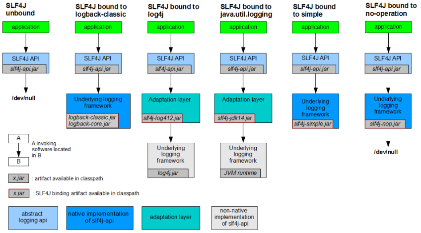
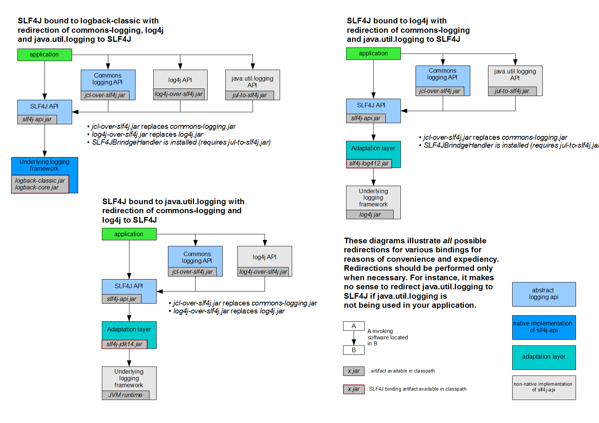

- 日志分层架构
	- 采用分层思想，面向接口编程
	- 分为 抽象层 和 实现层，用户面向抽象层编程（写日志），引入不同的实现层都可以无缝切换
- 抽象层和实现层的一些实现
	- 抽象层
		- JCL：Jakarta Commons Logging
			- apache 项目，2014 年就不更新了，Spring 默认使用
		- SLF4J
		- Jboss logging
	- 实现层
		- jul：Java.util.logging 功能不够强大
		- log4j：apache，存在一定的性能问题，不再更新了，变成了 log4j2
		- logback：log4j 的升级版，解决了 log4j 的性能问题
		- log4j2：apache 项目，整合度不比 logback
	- > SLF4J ，log4j，logback 是同一个作者
- Springboot 和 spring 默认日志框架
	- SpringBoot 默认使用 SLF4J + logback
	- Spring 默认使用 JCL，也就是 commons logging
- SLF4J 的使用，配合不同的实现层
  collapsed:: true
	- {:height 373, :width 544}
- 统一日志框架的使用 [slf4j Bridging legacy APIs](www.slf4j.org/legacy.html)
	-
	  1. 将原来的其他日志包排除，如排除 Spring 的 commons log
	-
	  2. 导入 slf4j 的对应的转换包，commons-log 替换包为 `jcl-over-slf4j.jar`
	-
	  3. 选择 slf4j 的实现日志包
	- 其他的一些替换包，以及具体替换使用方式
	  collapsed:: true
		- 
- Springboot 日志配置
	- 五个日志级别
		- trace < debug < info < warn < error
	- 默认配置
		- 级别为 info
		- 只会输出到控制台
		- 文件达到 10MB 会切分一次
	- 自定义配置
		- `application.yml` 方式配置
			- ```yaml
			  logging:
			    level: debug # 所有日志等级
			      #top.maoyilan: debug 对特定包指定等级
			      
			  # 其他的再说
			  ```
		- `logback-spring.xml` 配置，也可以是 `logback.xml`，带上 `-spring` 会有一些 `spring boot` 特有配置项
			- [参考1](https://blog.csdn.net/inke88/article/details/75007649)
			- [参考2](https://blog.csdn.net/mu_wind/article/details/99830829)
			- 根节点 `<configuration>`，有三个属性
			  collapsed:: true
				- scan：Boolean，是否在修改时自动加载
				- scanPeriod：自动加载检测的时间间隔，默认 1 min，默认单位为 ms，在 scan=true 时才有效
				- debug：Boolean
			- 五个子节点
				- <root>：必需节点，指定基础日志级别，一个 level 属性
				  collapsed:: true
					- 默认级别为 debug
					- 七个选项，五个级别+两个特殊选项，大小写无关
						- TRACE, DEBUG, INFO, WARN, ERROR, ALL 和 OFF
					- ```xml
					  <root level="">
					    <appender-ref ref="console"/>
					    <appender-ref ref="file"/>
					  </root>
					  ```
				- <contextName>：上下文名称，默认为 default
				  collapsed:: true
					- 可以在 pattern 中使用 `%contextName` 输出
					- `<contextName>debug demo</contextName>`
				- <property>：设置变量
				  collapsed:: true
					- `<property name="logHome" value="/Users/cctga/"/>`
					- 定义后可以使用 `${}` 来使用变量
					- `<FileNamePattern>${logHome}/my.log.%d{yyyy-MM-dd}.log</FileNamePattern>`
				- <appender>：格式化日志输出模版，有 name 属性和 class 属性
					- > 只配置 appender 是不会真的产生日志的，appender 只是一个模版，要把 appender 给予 root 或 logger 才能真的产生日志
					- name 指定格式模版的名称
					- class 指定输出策略，类的全路径
						- 有三个典型策略：FileAppender，ConsoleAppender，RollingFileAppender，分别为文件输出，控制台输出和滚动文件输出
				- <logger>：为指定包指定日志级别，格式，有一个向上传递的属性很特殊，可以看看
		- `log4j2-spring.xml` 配置
-