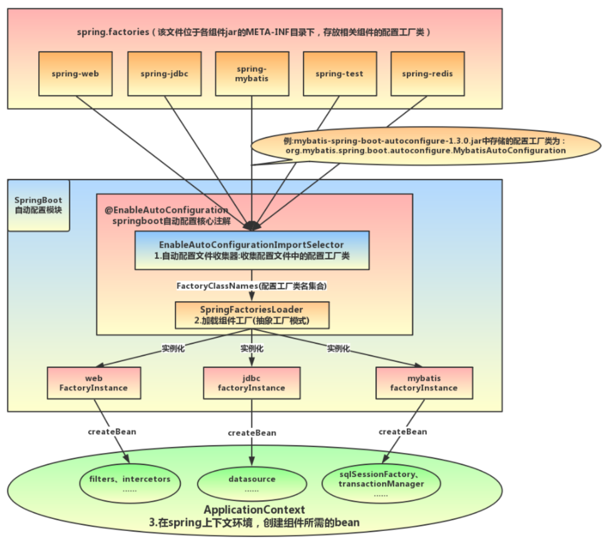

- 依赖管理
	- 不用指定 jar 包的版本号，如 spring-boot-starter-log4j2 版本
		- 在父依赖（spring-boot-dependencies）中使用 dependencyManagement 标签进行了版本管理
	- 不用引入相关的 jar 包，如 tomcat 相关 jar 包
		- 在各个 starter 中进行了 jar 的^^直接依赖^^，利用 maven 依赖传递的特性，相当于当前项目也已经引入了
- 自动配置
	- ((619f64c3-c09e-4531-b23d-30ddc19c25bd))
		- ((619f6393-607b-4357-877c-6e66bfd9f4fd))
			- ((619f64c3-15fb-44ed-8934-b62be65384d1))
			- 导入 `AutoConfigurationImportSelector.class`
				- 作用就是将所有符合条件的 ((a097a055-ec1d-40e8-b0de-5ccc5c5ff585)) 类都加入 IOC
				- 怎么做到的
					- 实现了多个 Aware，获取多个 ioc 重要对象
					  collapsed:: true
						- BeanClassLoaderAware 获取 beanClassLoader
						- ResourceLoaderAware 获取 resourceLoader
						- BeanFactoryAware 获取 beanFactory
						- EnvironmentAware 获取 environment
					- 实现 DeferredImportSelector 接口
	- {:height 628, :width 557}
-
- 应用初始化
	- `new SpringApplication()`
		- 推断应用类型
		- 读取所有的 spring.factories 配置文件，依次注册其中所有的 Bootstrapper，ApplicationContextInitializer（初始化类），ApplicationListener（Spring 生命周期监听器）
		- 找到有 main 方法的主配置类（启动类）
	- `springApplication.run()`
		- 获取并启动监听器，从配置文件 spring.factories 中读取 SpringApplicationRunListener
			- 负责在 SpringBoot 不同阶段给 ApplicationListener 广播消息
			- 构建应用上下文环境 ConfigurableEnvironment
				- 读取服务器环境变量，如 JAVA_HOME，MAVEN_HOME 等
				- 读取 Java 中的参数，如
	- SpringBoot 负责将所有需要自动装配的类收集起来交给 spring 生成 BeanDefinition、生成 Bean
-
- [[内嵌 Tomcat 原理]]
-
-