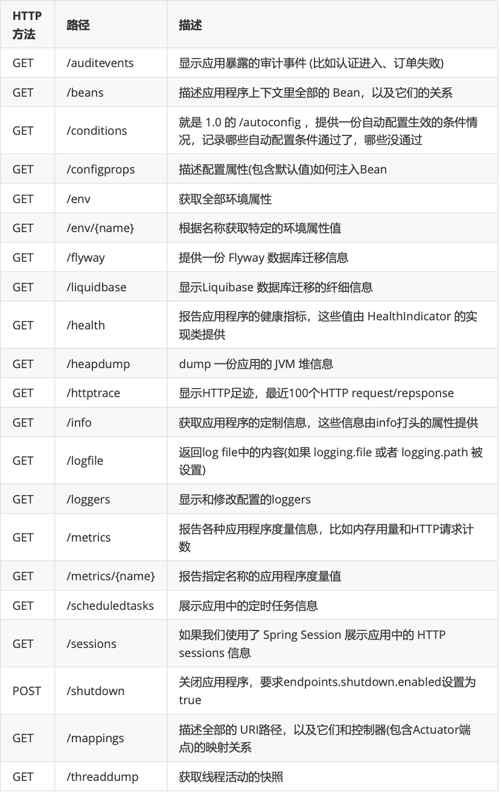

- 打成 jar 包并部署
  collapsed:: true
	- 依靠 spring boot 提供的插件 spring-boot-maven-plugin
	- ```xml
	  <build>
	    <plugins>
	      <plugin>
	        <groupId>org.springframework.boot</groupId>
	        <artifactId>spring-boot-maven-plugin</artifactId>
	      </plugin>
	    </plugins>
	  </build>
	  ```
- war 包并部署
  collapsed:: true
	- 注意，用这种方式部署的话，配置文件中的 `server.port` 等配置就无效了
	-
	  1. 修改打包方式 jar -> war
		- ```xml
		  <packaging>war</packaging>
		  ```
	-
	  2. 添加 `javax.servlet-api` 依赖
		- ```xml
		  <!--添加servlet-api的依赖,用来打war包 -->
		  <dependency>
		    <groupId>javax.servlet</groupId>
		    <artifactId>javax.servlet-api</artifactId>
		    <scope>provided</scope>
		  </dependency>
		  ```
	-
	  3. 排除 springboot 内置 tomcat
		- ```xml
		  <!--最终打成war包，排除内置的tomcat--> 
		  <dependency>
		    <groupId>org.springframework.boot</groupId>
		    <artifactId>spring-boot-starter-web</artifactId>
		    <exclusions>
		      <exclusion>
		        <groupId>org.springframework.boot</groupId>
		        <artifactId>spring-boot-starter-tomcat</artifactId>
		      </exclusion>
		    </exclusions>
		  </dependency>
		  ```
	-
	  4. 修改启动类，继承 SpringBootServletInitializer 类并重写 configure 方法
		- ```java
		  @SpringBootApplication
		  public class SpringBootMytestApplication extends
		  SpringBootServletInitializer {
		    public static void main(String[] args) {
		      SpringApplication.run(SpringBootMytestApplication.class, args);
		    }
		    @Override
		    protected SpringApplicationBuilder configure(SpringApplicationBuilder
		                                                 builder) {
		      // 注意这里要指向原先用main方法执行的Application启动类
		      return builder.sources(SpringBootMytestApplication.class);
		    }
		  ```
	-
	  5. 依旧需要 spring-boot-maven-plugin 插件
- jar 和 war 对比
	- jar 不会打包 src/main/webapp 中的内容，而 war 会
	- 对于前后端分离的项目来说，jar 非常合适
	- 如果需要一起部署前端，有 js，html 文件的时候，war 方便一点，可以直接覆盖修改的 js 和 html
- 多环境部署
	-
	  1. ((61b0a8b4-b885-4817-9bd2-f77c0a28f6f8))
	-
	  2. 多环境资源文件
		- 可以提供多个 application 配置文件，以一定的格式命名，在激活相应的环境时，springboot 就会自动加载相应环境的配置文件
		- > 激活配置配置在 application.yml 中
		- 命名格式
		  collapsed:: true
			- `application-{profile}.yml`
			- 如：`application-prod.yml`，`application-dev.yml`
-
-
- 项目监控 **Actuator**
	- [官方文档](https://docs.spring.io/spring-boot/docs/current/reference/html/actuator.html#actuator)
	- 对单个 Spring Boot的监控，信息包含:应用状态、内存、线程、堆栈等等，比较全面的监控了Spring Boot应用的整个生命周期。特别对于微服务管理十分有意义。
	- 提供了一系列接口（默认 13 个）来提供系统信息查询，可以自定义增加接口
		- 应用配置类：加载的配置，环境，请求映射等
		- 度量指标类：运行动态信息，堆栈，请求链等
		- 操作控制类：关闭监控功能
		- 提供了 13 个接口，其中 info 中的信息为自定义信息
		  collapsed:: true
			- {:height 644, :width 403}
	- 基本使用
	  collapsed:: true
		- 一般在使用的时候会添加验证功能，`spring-boot-starter-security`，可以选择不加
		-
		  1. 引入 `spring-boot-starter-actuator`
		-
		  2. 一些基本配置
			- ```yaml
			  management:
			    endpoints:
			      web:
			        # 路径
			        base-path: /manager
			        # 要显示的节点，如 info,health，* 表示全部
			        exposure:
			          include: '*'
			    endpoint:
			      # 显示详细的健康信息
			      health:
			        show-details: always
			        # 允许通过接口关闭 Springboot
			      shutdown:
			        enabled: true
			  ```
	- 部分接口(端点)详细介绍
	  collapsed:: true
		- health
		  collapsed:: true
			- 主要用来检查应用的运行状态，这是我们使用最高频的一个监控点。通常使用此接口提醒 我们应用实例的运行状态，以及应用不”健康“的原因，比如数据库连接、磁盘空间不够等。
			  默认情况下 health 的状态是开放的，添加依赖后启动项目，访问: http://localhost:8080/actuator/health 即可看到应用的状态。
			  应用的状态：
				- ```json
				  {
				  	"status": "up"
				  }
				  ```
			- health 通过合并几个健康指数检查应用的健康情况。
			- Spring Boot Actuator 有几个预定义的健康 指标比如 DataSourceHealthIndicator , DiskSpaceHealthIndicator ,MongoHealthIndicator , RedisHealthIndicator 等，它使用这些健康指标作为健康检查的一 部分。
			- 举个例子，如果你的应用使用 Redis， RedisHealthindicator 将被当作检查的一部分;如果使 用 MongoDB，那么 MongoHealthIndicator 将被当作检查的一部分。
			  可以在配置文件中关闭特定的健康检查指标，比如关闭 redis 的健康检查:
				- ```properties
				  management.health.redis.enabled=false
				  ```
			- 默认，所有的这些健康指标被当作健康检查的一部分。
		- info
		  collapsed:: true
			- info 就是我们自己配置在配置文件中以 info 开头的配置信息，比如我们在示例项目中的配置是:
				- ```properties
				  info.app.name=spring-boot-actuator
				  info.app.version= 1.0.0
				  info.app.test= test
				  ```
			- 可以通过实现接口 `InfoContributor` 来配置复杂的 info 内容
				- ```java
				  @Component
				  public class CustomInfoContributor implements InfoContributor {
				  
				    @Autowired private StringRedisTemplate template;
				  
				    @Override
				    public void contribute(Info.Builder builder) {
				      String s = template.opsForValue().get("temp::1");
				      builder.withDetail("redis::user::temp::1", s);
				    }
				  }
				  ```
		- beans
			- 展示了系统中的 Bean 的信息，别名，类型，依赖等
		- conditions
			- 可以查看某个配置生效的条件
		- heapdump
			- 查看 JVM 的堆 dump，会下载一个快照文件
		- mappings
			- 查看系统所有的 URL 路径，以及相应的映射器是什么
		- threaddump
			- 查看系统的线程快照
		- shutdown
			- 优雅关闭系统，需要配置，`management.endpoint.shutdown.enabled=true`，并且请求类型需要是 post
	- 自定义端点
		- 有时候我们需要自定义自己的端点，我们可以通过
		  @Endpoint注解 + @ReadOperation、@WriteOperation、@DeleteOperation注解来实现自定义端点。形如下
		- ```java
		  @Component
		  @Endpoint(id = "customEndpoint")
		  public class CustomEndpoint {
		  
		    // @ReadOperation 对应GET请求
		  
		    /**
		     * 请求示例：
		     * GET http://localhost:8080/actuator/customEndpoint/zhangsan/20
		     * @param username
		     * @param age
		     *
		     * @return
		     */
		    @ReadOperation
		    public Map<String, Object> endpointByGet(@Selector String username,@Selector Integer age) {
		      Map<String, Object> customMap = new HashMap<>();
		      customMap.put("httpMethod", HttpMethod.GET.toString());
		      customMap.put("username",username);
		      customMap.put("age",age);
		      return customMap;
		    }
		  
		  
		    // @WriteOperation 对应POST请求
		  
		    /**
		     * 请求示例：
		     * POST http://localhost:8080/actuator/customEndpoint
		     *
		     * 请求参数为json格式
		     *
		     * {
		     *     "username": "zhangsan",
		     *     "age": 20
		     * }
		     *
		     * @param username 参数都为必填项
		     * @param age 参数都为必填项
		     * @return
		     */
		    @WriteOperation
		    public Map<String, Object> endpointByPost(String username,Integer age) {
		      Map<String, Object> customMap = new HashMap<>();
		      customMap.put("httpMethod", HttpMethod.POST.toString());
		      customMap.put("username",username);
		      customMap.put("age",age);
		      return customMap;
		    }
		  
		  
		    // @DeleteOperation 对应Delete请求
		  
		    /**
		     * 请求示例：
		     * DELETE http://localhost:8080/actuator/customEndpoint
		     *
		     * @return
		     */
		    @DeleteOperation
		    public Map<String, Object> endpointByDelete() {
		      Map<String, Object> customMap = new HashMap<>();
		      customMap.put("httpMethod", HttpMethod.DELETE.toString());
		  
		      return customMap;
		    }
		  
		  }
		  ```
- 监控工具 `spring-boot-admin`
	- 依赖 actuator，对其进行了封装，提供了 UI 界面
	- 需要客户端和服务端，服务端可以监听多个 spring-boot 项目
	- 服务端配置
		- 引入 jar
		- ```xml
		  
		  <dependency>
		    <groupId>de.codecentric</groupId>
		    <artifactId>spring-boot-admin-starter-server</artifactId>
		    <version>2.5.2</version>
		  </dependency>
		  ```
		- > 打开服务开关 `@EnableAdminServer`
	- 客户端配置
		- 引入 jar
		- ```xml
		  
		  <dependency>
		    <groupId>de.codecentric</groupId>
		    <artifactId>spring-boot-admin-starter-client</artifactId>
		    <version>2.5.4</version>
		  </dependency>
		  ```
		- 配置
			- ```yaml
			  #自定义配置信息用于"/actuator/info"读取
			  info:
			    name: 老王
			    age: 100
			    phone: 110
			  #通过下面的配置启用所有的监控端点，默认情况下，这些端点是禁用的;
			  management:
			    endpoints:
			      web:
			        # 路径
			        base-path: /manager
			        # 要显示的节点，如 info,health，* 表示全部
			        exposure:
			          include: '*'
			    endpoint:
			      # 显示详细的健康信息
			      health:
			        show-details: always
			        # 允许通过接口关闭 Springboot
			      shutdown:
			        enabled: true
			      ## 将Client作为服务注册到Server，通过Server来监听项目的运行情况
			  spring:
			    boot:
			      admin:
			        client:
			          url: http://localhost:8081
			    ##application实例名
			    application:
			      name: spring-boot-admin-client
			  
			  ```