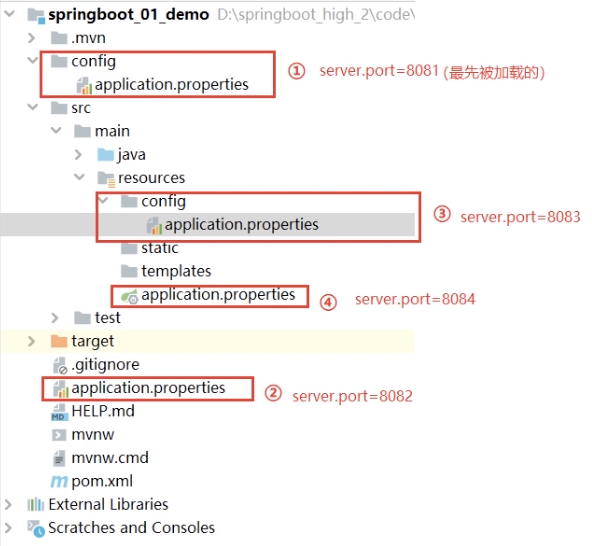

- 是什么
  collapsed:: true
	- 约定优于配置，简化配置，脚手架，快速构建 Spring 项目
	- 基于 Spring4.0，SpringBoot2.0 基于 Spring5.0
- 4 个主要特性
  collapsed:: true
	- SpringBoot Starter 起步依赖
	  collapsed:: true
		- 整合一些功能的 maven 包，避免自己去繁琐的引入
		- 解决版本冲突问题
	- JavaConfig 配置，注解配置
	- 自动配置
		- 借助于 `spring.factories` 文件
		- 添加 jar 包依赖，自动将其中的一些类注册到 IOC，方便使用
	- 快速部署
		- 内置 Servlet 容器，Tomcat（默认），Jetty，undertow，只需要 Java 环境
		- Jar 包运行
- 全局配置文件
  collapsed:: true
	- `application.properties` 或 `application.yaml`
	- 默认 4 个加载位置，依次加载，冲突时使用先加载的配置，两种类型 yaml 优先级更高（`>=2.4.0`）
		- 在 2.4.0 版本之前，properties 类型优先级更高
		- 如果在大于 2.4.0 版本中想让 properties 优先级更高，可以使用如下配置
			- ```properties
			  spring.config.use-legacy-processing=true
			  ```
		- 根目录/config/，根目录，classpath:/config/，classpath:/
			- {:height 286, :width 282}
			- 打成 jar 包后的 根目录/config/ 的配置文件，也就是和 jar 包同目录下的 /config
				- ```text
				  # springboot 会自动读取同级目录下的配置文件，且优先级最高
				  project.jar
				  config/
				  	application.yaml
				  ```
	- 指定额外的配置
		- 指定配置文件扩展名
		- ```java
		  java -jar project.jar --spring.config.name=mytype
		  ```
		- 指定不同其他位置的配置文件(不互补，不会读取项目内的配置文件，可以使用逗号指定多个)
		- ```java
		  java -jar project.jar --spring.config.location=./config/application.yaml
		  ```
		- ```java
		  
		  // --spring.config.additional-location 会读取项目内配置文件互补配置
		  java -jar project.jar --spring.config.additional-location=./config/application.yaml
		  ```
	- 自定义配置项
		- 需要使用注解 ((619bb344-da22-4492-8e06-a78e832860ed)) 来注入自定义的配置项
		- 通过添加 `spring-boot-configuration-processor` 依赖来提供提示
			- ```xml
			  <dependency>
			    <groupId>org.springframework.boot</groupId>
			    <artifactId>spring-boot-configuration-processor</artifactId>
			    <optional>true</optional>
			  </dependency>
			  ```
		- 待注入的类
			- ```java
			  @Component
			  @ConfigurationProperties(prefix = "person")   //实现批量注入（set方法）
			  public class Person {
			  
			    private int id;            //id
			    private String name;      //名称
			    private List hobby;       //爱好
			    private String[] family; //家庭成员
			    private Map map;
			    private Pet pet;          //宠物
			  //...
			  }
			  ```
		- 配置项
			- ```properties
			  # 自定义属性
			  # properties 格式
			  person.id=1
			  person.name=jack
			  person.hobby=吃饭,睡觉,打豆豆
			  person.family=father,mother
			  person.map.k1=v1
			  person.map.k2=v2
			  person.pet.type=dog
			  person.pet.name=旺财
			  ```
			- ```yaml
			  #yml 格式
			  person:
			    id: 2
			    name: lucy
			    hobby: [ 吃饭,睡觉,打王者 ]
			    family: [ father,mother ]
			    map: { k1: v1,k2: v2 }
			    pet: { type: pig,name: 佩奇 }
			  ```
- [[spring-devtools 热部署]]
- [[Spring Boot 注解]]
- [[Spring Boot 日志]]
- [[SpringBoot 自定义 Starter]]
- [[Spring Boot 源码]]
- [[内嵌 Tomcat 原理]]
- [[Spring Boot 缓存]]
- [[Spring Boot 部署和监控]]
-
- 解决中文乱码
  collapsed:: true
	- 方法一
	  collapsed:: true
		- collapsed:: true
		  ```java
		  @RequestMapping(produces="application/json;charset=utf-8")
		  ```
	- 方法二
	  collapsed:: true
		- collapsed:: true
		  ```xml
		  spring.http.encoding.force-response=true
		  ```
	- 方法三
	  collapsed:: true
		- collapsed:: true
		  ```java
		  response.setCharacterEncoding("utf-8");
		  ```
-
-
-
-