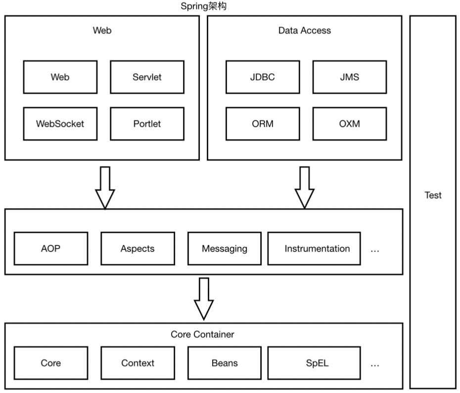

alias:: Spring Framework

- Spring 优势
	- 解耦，简化（单例，文件解析）
	- AOP
	- 声明式事务支持 `@Transactional`
	- 方便测试
	- 集成优秀框架
	- 降低 JavaEE API 的使用难度
	- 优秀的源码
	- 从 Spring 3.0 开始就可以使用 JavaConfig，而不需要 applicationContext.xml 配置
- 不同版本要求的 jdk
	- 5.x -> jdk8+
	- 4.x -> jdk6+
	- 3.x -> jdk5+
- 核心结构
	- {:height 357, :width 401}
- [[Spring IOC]]
- [[Spring DI]]
- [[Spring AOP]]
  id:: 617a856c-0d10-4db0-bb44-d3dc0018c569
- [[声明式事务控制]]
- [[Spring 注解]]
- [[Spring 的包及其功能]]
-
- 其他 ---
- [[SpringMVC]]
- [[Spring Data JPA]]
- [[Spring Boot]]
-
- [[SSM 整合]]
-