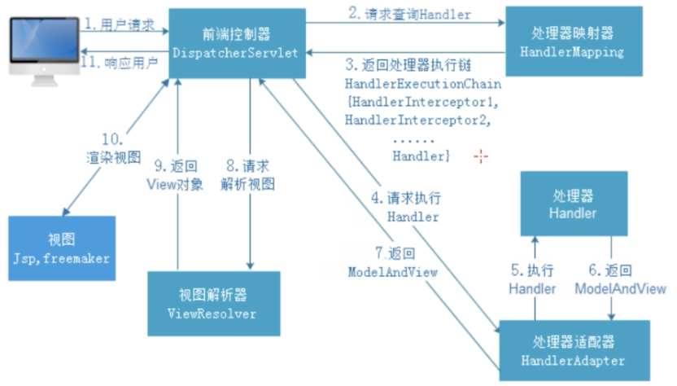

- 请求流程
  id:: 6187c41a-528f-4149-a5e0-1652ea0a59bf
	- {:height 410, :width 592}
- 基础配置
	- 配置 DispatcherServlet 前端控制器 在 web.xml 中配置
	  ```xml
	  <servlet>
	    <servlet-name>springmvc</servlet-name>
	    <servlet-class>org.springframework.web.servlet.DispatcherServlet</servlet-class>
	  </servlet>
	  ```
	- 配置前端控制器拦截路径 在 web.xml 中配置
	  ```xml
	  <servlet-mapping>
	    <servlet-name>springmvc</servlet-name>
	    <url-pattern>/</url-pattern>
	  </servlet-mapping>
	  ```
		- 路径典型配置
			- `/`  最低匹配级别，会优先使用其他配置（可以有多个 url-pattern）或使用默认的配置，但是会出现静态资源访问不了的问题，不过现在都前后端分离了，不需要访问静态资源
				- 静态资源访问不了的问题原因
				  原因是 tomcat 有一个相同的默认配置来处理静态资源，我们这边做相同的配置会将其覆盖，但是我们的 springmvc 又不处理静态资源，所以会导致静态资源无法访问
				- 问题解决 在 springmvc.xml 中添加一些配置
					- 重新配置使用默认配置
					  当匹配不到的时候就尝试使用 tomcat 默认配置
					  问题是当静态资源放在 WEB-INF 或 classpath 下时就不能直接访问了，还是要使用 springmvc 的静态资源处理才最好
					  ```xml
					  <mvc:default-servlet-handler/>
					  ```
					- 为 springMVC 配置静态资源处理
					  id:: 6187c41a-7640-4c72-b4fa-5897bce4c4ea
					  ```xml
					  <mvc:resources mapping="/**" location="/"/>
					  
					  <!-- 允许访问 classpath 下的内容 -->
					  <mvc:resources mapping="/resources/**" location="classpath:/"/>
					  <mvc:resources location="/WEB-INF/js/" mapping="/js/**"/>
					  ```
				- 为什么不拦截 jsp
					- 因为 tomcat 单独配置了一个 *.jsp 拦截器，会优先匹配
			- `/*` 拦截所有配置（一般肯定不会这样配置），包括静态资源和 controller 的视图转发，会导致静态资源无法访问，视图转发的视图也无法正常返回
			- `*.do` 只会拦截 do 结尾的请求，静态资源和视图转发都能正常工作，但是无法支持 [[RESTful]]
	- 开发 Controller 类
	- 在 springmvc.xml 中配置 xml 类扫描和 springmvc 三大件
		- springmvc 三大件
			- 视图解析器 InternalResourceViewResolver
			- 处理器映射器
			- 处理器适配器
		- ```xml
		  <!-- 配置包扫描 -->
		  <context:component-scan base-package=""/>
		  
		  <!-- 配置视图解析器 -->
		  <bean class="">
		    <property name="prefix" value="/WEB-INF/jsp"/>
		    <property name="suffix" value=".jsp"/>
		  </bean>
		  
		  <!-- 配置 处理器映射器和 处理器适配器 -->
		  <!-- 表示使用自动配置两者 -->
		  <mvc:annotation-driven/>
		  ```
	- 在 web.xml 中配置 springmvc.xml 路径给前端控制器
	  ```xml
	  <servlet>
	    <servlet-name>springmvc</servlet-name>
	    <servlet-class>org.springframework.web.servlet.DispatcherServlet</servlet-class>
	    <init-param>
	      <param-name>contextConfigLocation</param-name>
	      <param-value>classpath:springmvc.xml</param-value>
	    </init-param>
	  </servlet>
	  ```
- 九大组件
  id:: 6187c41a-d1cc-461f-a342-b9a0ad15dc19
	- HandlerMapping 处理器映射器
		- 管理着所有的 Handler 和 HandlerInterceptor
		- 默认 MVC 使用两种
			- BeanNameUrlHandlerMapping
			- BeanNameUrlHandlerMapping
	- HandlerAdapter 处理器适配器
		- 负责执行 Handler 和 HandlerInterceptor 并返回执行结果（ModelAndView）
		- 默认 MVC 使用三种
		  id:: 618be94e-f0c1-4773-a1b3-34f19e6e5200
			- SimpleControllerHandlerAdapter
				- 那些通过继承 Controller 而生成的 Handler 使用
			- HttpRequestHandlerAdapter
			- RequestMappingHandlerAdapter
	- HandlerExceptionResolver 处理器异常解析器
		- 找到异常处理器执行并返回结果（ModelAndView）
	- ViewResolver 视图解析器
		- 默认实现为 `InternalResourceViewResolver`
		- 找到视图文件，如 html，jsp 等，然后返回 View 对象
	- RequestToViewNameTranslator 请求转换为视图名称
	  id:: 6187c41a-1723-4b7e-9277-8b9f7888051c
		- 有的 Handler 没有返回视图地址，这个组件用来处理这种缺省的情况，会将请求路径作为视图名称，供 ViewResolver 使用来解析视图，但往往找不到😂
	- LocateResolver
		- 支持国际化，会从请求从解析出 Locale，比如中国是 zh-CN
		- ViewResolver组件的resolveViewName方法需要两个参数，-个是视图名，一个是Locale.
		  LocaleResolver用于从请求中解析出Locale,比如中国Locale是zh-CN,用来表示一个区域。这个组件也
		  是i18n的基础。
	- ThemeResolver 主题解析器
		- > ThemeResolver组件是用来解析主题的。主题是样式、图片及它们所形成的显示效果的集合。Spring MVC中一套主题对应一个properties文件，里面存放着与当前主题相关的所有资源，如图片、CSS样式等。创建主题非常简单，只需准备好资源，然后新建一个”主 题名.properties"并将资源设置进去，放在classpath下，之后便可以在页面中使用了。SpringMVC中与 主题相关的类有ThemeResolver. ThemeSource和Theme。ThemeResolver 负责从请求中解析出主题名，ThemeSource根据主 题名找到具体的主题，其抽象也就是Theme，可以通过Theme来获取主题和具体的资源。
	- MultipartResolver 文件上传功能
		- 用于上传请求，会将普通请求包装成 MultipartHttpServletRequest ，然后使用 getFile 方法就能获取文件
		- 就是封装普通请求，使其拥有文件上传的功能
	- FlashMapManager
		- 用来管理 FlashMap，用于重定向时的参数传递
		- > FlashMap用于重定向时的参数传递，比如在处理用户订单时候，为了避免重复提交,可以处理完post请求之后重定向到一个get请求，这个get请求可以用来 显示订单详情之类的信息。这样做虽然可以规避用户重新提交订单的问题，但是在这个页面上要显示订单的信息，这些数据从哪里来获得呢?因为重定向时么有传递参数这一功能的，如果不想把参数写进URL (不推荐)，那么就可以通过FlashMap来传递。只需要在重定向之前将要传递的数据写入请求(可以通过ServletRequestAttributes getRequest()方法获得)的属性OUTPUT_ FLASH_ _MAP. ATTRIBUTE中，这样在重定向之后的Handler中Spring就会自动将其设置到Model中，在显示订单信息的页面上就可以直接从Model中获取数据。FlashMapManager 就是用来管理FalshMap的。
- Handler 中会自动注入的一些对象
	- HttpServletRequest
	- HttpServletResponse
	- HttpSession
	- ModelAndView
	- Model，ModelMap，Map <- BindingAwareModelMap
- 参数绑定
	- 简单数据类型
		- 尽量使用包装类，对于 Boolean 来说，只接受四个值，true，false，0，1
	- 简单 Bean
	- 包装 Bean
		- Park{User user{String name}}，注入 name：传入参数名为 user.name 就行
	- 日期
		- 使用参数类型转换器：实现 [Converter](org.springframework.core.convert.converter.Converter) 接口，来创建一个类型转换器
		- ```java
		  public class DateConverter implements Converter<String, Date> {
		    @Overried
		    public Date convert(String source){
		      SimpleDateFormat sdf = new SimpleDateFormat("yyyy-MM-dd");
		      return sdf.format(source);
		    }
		  }
		  ```
- 参数转换器的使用
	- 创建一个类型转换器，实现 [Converter](org.springframework.core.convert.converter.Converter) 接口
		- ```java
		  public class DateConverter implements Converter<String, Date> {
		    final SimpleDateFormat simpleDateFormat = new SimpleDateFormat("yyyy-MM-dd");
		    @Override
		    public Date convert(String source) {
		      // 完成字符串向日期的转换
		      try {
		        return simpleDateFormat.parse(source);
		      } catch (ParseException ignore) {
		      }
		      return null;
		    }
		  }
		  ```
	- 注册自定义的转换，在 springmvc.xml 配置文件中
		- ```xml
		  <!--注册自定义类型转换器-->
		  <bean id="conversionServiceBean" class="org.springframework.format.support.FormattingConversionServiceFactoryBean">
		    <property name="converters">
		      <set>
		        <bean class="com.lagou.edu.converter.DateConverter"></bean>
		      </set>
		    </property>
		  </bean>
		  ```
		- 配置到 HandlerAdaptor
			- ```xml
			  <!--
			      自动注册最合适的处理器映射器，处理器适配器(调用handler方法)
			  -->
			  <mvc:annotation-driven conversion-service="conversionServiceBean"/>
			  ```
- [[RESTful]] 的支持
	- 路径参数的支持 @PathVariable
	- 请求方式的匹配 @RequestMappding(method=?)
	- ```java
	  @RequestMapping(value = "/handle/{id}", method = {RequestMethod.GET})
	  public ModelAndView handleGet(@PathVariable("id") Integer id) {
	    Date date = new Date();
	    ModelAndView modelAndView = new ModelAndView();
	    modelAndView.addObject("date",date);
	    modelAndView.setViewName("success");
	    return modelAndView;
	  }
	  ```
	- 拦截器拦截参数 `_method` 指定的请求方式
		- 为了解决 html 中 from 中的请求方式只能指定为 get 和 post
		- 需要发送一个参数, 名称为 _method , 用来指定请求方式,如 put
	- ```xml
	  <filter>
	    <filter-name>hiddenHttpMethodFilter</filter-name>
	    <filter-class>org.springframework.web.filter.HiddenHttpMethodFilter</filter-class>
	  </filter>
	  
	  <filter-mapping>
	    <filter-name>hiddenHttpMethodFilter</filter-name>
	    <url-pattern>/*</url-pattern>
	  </filter-mapping>
	  ```
- 过滤器
  id:: 6187c41a-7b82-4656-b0df-aa6d217f4951
	- 过滤器是属于 tomcat 的内容，过滤器是 springmvc 的内容
	- 在 web.xml 中配置
	- {{embed ((6187bea2-d10c-444c-a48a-92b38d066177))}}
- Ajax json 交互
	- ((6187c818-ca36-4222-a52f-be386bf07804))
	- ((6187c838-d407-4aab-930c-74068078276d))
- 重定向
  id:: 61891997-8232-436b-849f-18638154b775
	- 为 View 添加前缀 `redirect:` SpringMVC 就会完成简单的重定向
		- 简单的 Get 重定向
		- 底层就是使用 RedirectView 视图组件进行重定向的
	- 使用 RedirectView 进行复杂的重定向
		- 悲剧，不知道怎么用，再说吧...
		- ```java
		  /**  
		    * 请求进行重定向  
		    */  
		  @RequestMapping(value = "postPayAmount", method = RequestMethod.GET)   
		  public RedirectView postPayAmount(HttpSession session,ModelMap map) {   
		    return new RedirectView(WsUrlConf.URI_PAY,true,false,false);//最后的参数为false代表以post方式提交请求   
		  }  
		  
		  // 如果有数据需要携带可以使用
		  
		  return new ModelAndView(new RedirectView("xxx.do"), map);  
		  ```
- 转发
	- 为 View 添加前缀 `forward:`
	- 底层使用 `InternalResourceView` 视图组件进行转发
-