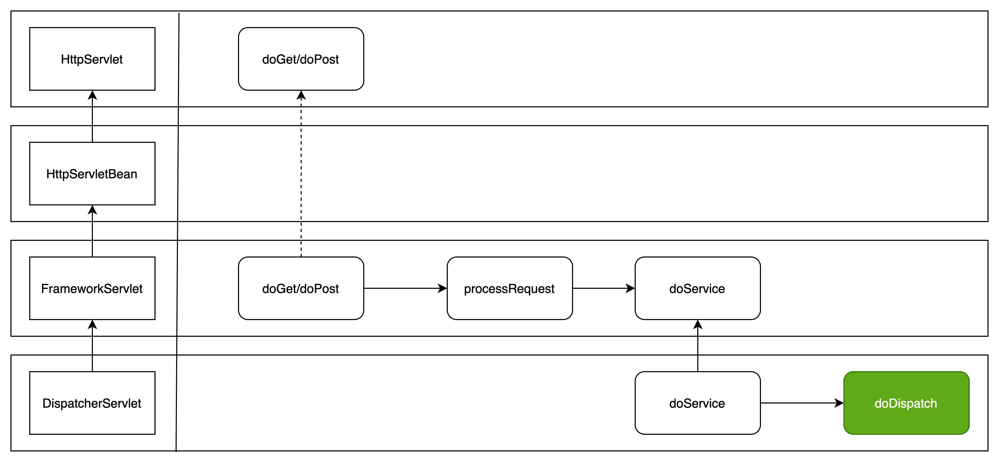

- {{embed ((6187c41a-528f-4149-a5e0-1652ea0a59bf))}}
- 调用入口
	- 
- doDispatch 主要逻辑
	- 获取执行链 handler + interceptor
		- ```java
		  // Determine handler for the current request.
		  // 获取执行器链，包括执行器和执行器链
		  mappedHandler = getHandler(processedRequest);
		  ```
		- getHandler 获取的方式就是依靠 处理器映射器来获取的，在 mvc 中默认有两个映射器对象 
		  1. RequestMappingHandlerMapping 
		  2. BeanNameUrlHandlerMapping （当前用的是这种）
		  组成了 handlerMappings，在容器启动的时候会自动初始化并完成 Handler 的映射
		- ```java
		  @Nullable
		  protected HandlerExecutionChain getHandler(HttpServletRequest request) throws Exception {
		    if (this.handlerMappings != null) {
		      for (HandlerMapping mapping : this.handlerMappings) {
		        HandlerExecutionChain handler = mapping.getHandler(request);
		        if (handler != null) {
		          return handler;
		        }
		      }
		    }
		    return null;
		  }
		  
		  ```
	- 根据 handler 来找到能执行的 handlerAdapter，处理器适配器
		- ((618be94e-f0c1-4773-a1b3-34f19e6e5200))
		- ```java
		  HandlerAdapter ha = getHandlerAdapter(mappedHandler.getHandler());
		  
		  // ==============
		  
		  // 在所有 handlerAdapter 中找到适配的
		  protected HandlerAdapter getHandlerAdapter(Object handler) throws ServletException {
		    if (this.handlerAdapters != null) {
		      for (HandlerAdapter adapter : this.handlerAdapters) {
		        if (adapter.supports(handler)) {
		          return adapter;
		        }
		      }
		    }
		    throw new ServletException("No adapter for handler [" + handler +
		                               "]: The DispatcherServlet configuration needs to include a HandlerAdapter that supports this handler");
		  }
		  ```
	- 处理器适配器调用处理器，总会返回 ModelAndView
		-
		- ```java
		  // Actually invoke the handler.
		  // 调用处理器
		  mv = ha.handle(processedRequest, response, mappedHandler.getHandler());
		  ```
	- 完成视图渲染
		- ```java
		  
		  // 跳转页面
		  processDispatchResult(processedRequest, response, mappedHandler, mv, dispatchException);
		  ```
- ((6187c41a-d1cc-461f-a342-b9a0ad15dc19)) 初始化
  collapsed:: true
	- 九大组件
	  collapsed:: true
		- 在类 DispatcherServlet 中
		- 使用接口引用，方便扩展
		- ```java
		  // 类 DispatcherServlet 中
		  
		  /** MultipartResolver used by this servlet. */
		  @Nullable
		  private MultipartResolver multipartResolver;
		  
		  /** LocaleResolver used by this servlet. */
		  @Nullable
		  private LocaleResolver localeResolver;
		  
		  /** ThemeResolver used by this servlet. */
		  @Nullable
		  private ThemeResolver themeResolver;
		  
		  /** List of HandlerMappings used by this servlet. */
		  @Nullable
		  private List<HandlerMapping> handlerMappings;
		  
		  /** List of HandlerAdapters used by this servlet. */
		  @Nullable
		  private List<HandlerAdapter> handlerAdapters;
		  
		  /** List of HandlerExceptionResolvers used by this servlet. */
		  @Nullable
		  private List<HandlerExceptionResolver> handlerExceptionResolvers;
		  
		  /** RequestToViewNameTranslator used by this servlet. */
		  @Nullable
		  private RequestToViewNameTranslator viewNameTranslator;
		  
		  /** FlashMapManager used by this servlet. */
		  @Nullable
		  private FlashMapManager flashMapManager;
		  
		  /** List of ViewResolvers used by this servlet. */
		  @Nullable
		  private List<ViewResolver> viewResolvers;
		  
		  ```
	- ```java
	  @Override
	  protected void onRefresh(ApplicationContext context) {
	    initStrategies(context);
	  }
	  
	  protected void initStrategies(ApplicationContext context) {
	    initMultipartResolver(context);
	    initLocaleResolver(context);
	    initThemeResolver(context);
	    initHandlerMappings(context);
	    initHandlerAdapters(context);
	    initHandlerExceptionResolvers(context);
	    initRequestToViewNameTranslator(context);
	    initViewResolvers(context);
	    initFlashMapManager(context);
	  }
	  ```
	- 初始化策略都是相同的，都是先从 ioc 中寻找相应的 class（可以配置成寻找指定的ID，而不是 class），如果没有就使用默认的 class 实例
	  collapsed:: true
		- ```java
		  private void initHandlerMappings(ApplicationContext context) {
		    this.handlerMappings = null;
		  
		    if (this.detectAllHandlerMappings) {
		      // Find all HandlerMappings in the ApplicationContext, including ancestor contexts.
		      // 根据 class 找到所有的 bean
		      Map<String, HandlerMapping> matchingBeans =
		        BeanFactoryUtils.beansOfTypeIncludingAncestors(context, HandlerMapping.class, true, false);
		      if (!matchingBeans.isEmpty()) {
		        this.handlerMappings = new ArrayList<>(matchingBeans.values());
		        // We keep HandlerMappings in sorted order.
		        AnnotationAwareOrderComparator.sort(this.handlerMappings);
		      }
		    }
		    else {
		      try {
		        // 根据 bean name 来寻找 bean
		        HandlerMapping hm = context.getBean(HANDLER_MAPPING_BEAN_NAME, HandlerMapping.class);
		        this.handlerMappings = Collections.singletonList(hm);
		      }
		      catch (NoSuchBeanDefinitionException ex) {
		        // Ignore, we'll add a default HandlerMapping later.
		      }
		    }
		  
		    // Ensure we have at least one HandlerMapping, by registering
		    // a default HandlerMapping if no other mappings are found.
		    // 都没有找到就创建默认的 class 实例
		    if (this.handlerMappings == null) {
		      this.handlerMappings = getDefaultStrategies(context, HandlerMapping.class);
		      if (logger.isTraceEnabled()) {
		        logger.trace("No HandlerMappings declared for servlet '" + getServletName() +
		                     "': using default strategies from DispatcherServlet.properties");
		      }
		    }
		  }
		  ```
	- 有一个组件是特例，文件上传组件 `initMultipartResolver`，所以我们配置文件上传组件的时候必须要指定固定的 bean id `multipartResolver`
		- ```java
		  private void initMultipartResolver(ApplicationContext context) {
		    try {
		      // 直接加载固定的 bean id
		      // MULTIPART_RESOLVER_BEAN_NAME = multipartResolver
		      this.multipartResolver = context.getBean(MULTIPART_RESOLVER_BEAN_NAME, MultipartResolver.class);
		      if (logger.isTraceEnabled()) {
		        logger.trace("Detected " + this.multipartResolver);
		      }
		      else if (logger.isDebugEnabled()) {
		        logger.debug("Detected " + this.multipartResolver.getClass().getSimpleName());
		      }
		    }
		    catch (NoSuchBeanDefinitionException ex) {
		      // Default is no multipart resolver.
		      this.multipartResolver = null;
		      if (logger.isTraceEnabled()) {
		        logger.trace("No MultipartResolver '" + MULTIPART_RESOLVER_BEAN_NAME + "' declared");
		      }
		    }
		  }
		  ```