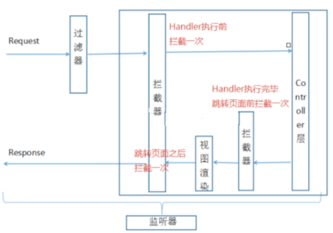

- 监听器、过滤器和拦截器
	- 过滤器 Filter #tomcat
		- 属于 tomcat ，JavaEE 的内容
		- 在 Servlet 之前过滤 Request，可以配置成 `/*` 过滤所有内容，包括静态资源
		- ((6187c41a-7b82-4656-b0df-aa6d217f4951))
	- 监听器 Listener #tomcat
		- 属于 tomcat ，JavaEE 的内容
		- 实现了 `javax.servlet.ServletContextListener` 接口的服务器端组件，随 web 应用的启动而启动，然后在整个生命周期中一直监听，直到随着应用关闭而销毁
		- 作用
			- 初始化 ((2275c93b-96cf-454a-ae61-5de52725f43d))，启动 IOC 容器
			- 监听 web 中的特定事件，如 `HttpRequest` 等的创建和销毁
	- 拦截器 Interceptor
		- 属于 SpringMVC 自身
		- 不能拦截静态资源，只能拦截 Handler 自身
		- 三次拦截
			- preHandle 进入 Handler 之前
			- postHandle 执行完 Handler ，但未跳转页面之前
			- afterCompletion 跳转页面，视图渲染之后
			- {:height 356, :width 461}
		- 使用
			- 定义
				- 实现 HandlerInterceptor 接口
			- 注册、定义拦截范围，默认所有
				- ```xml
				  
				  <mvc:interceptors>
				    <!--拦截所有handler-->
				    <!--<bean class="com.lagou.edu.interceptor.MyIntercepter01"/>-->
				  
				    <mvc:interceptor>
				      <!--配置当前拦截器的url拦截规则，**代表当前目录下及其子目录下的所有url-->
				      <mvc:mapping path="/**"/>
				      <!--exclude-mapping 可以在mapping的基础上排除一些url拦截-->
				      <!--<mvc:exclude-mapping path="/demo/**"/>-->
				      <bean class="com.lagou.edu.interceptor.MyIntercepter01"/>
				    </mvc:interceptor>
				  
				  </mvc:interceptors>
				  ```
		- 多个拦截器的执行顺序
			- 由配置位置决定，配置在前面的先执行
			- 其实就是多层代理，责任链模式
			- preHandler 为正序，其他两个为倒叙
			  ```text
			  preHandle1
			  
			  preHandle2
			  
			  HandlerAdaptor
			  
			  postHandle2
			  
			  postHandle1
			  
			  afterCompletion2
			  
			  afterCompletion1
			  ```
			-
- 文件上传
  collapsed:: true
	- 简化了原生 Servlet 的文件上传
	- 需要 jar 包 commons-fileupload
		- ```xml
		  <!--文件上传所需-->
		  <dependency>
		    <groupId>commons-fileupload</groupId>
		    <artifactId>commons-fileupload</artifactId>
		    <version>1.3.1</version>
		  </dependency>
		  ```
	- 要求
		- 前端
			- 表单提交
			- `method=post`
			- `enctype=multipart/form-data`
			- file 组件 `<input type="file" name="updateFile">`
			- ```html
			  <form method="post" enctype="multipart/form-data" action="demo/upload">
			    <input type="file" name="uploadFile"/>
			    <input type="submit" value="上传"/>
			  </form>
			  ```
		- 后台
			- 文件的获取和处理
				- ```java
				  @RequestMapping(value = "/upload")
				  public ModelAndView upload(MultipartFile uploadFile,HttpSession session) throws IOException {
				    // 处理上传文件
				    // 重命名，原名123.jpg ，获取后缀
				    String originalFilename = uploadFile.getOriginalFilename();// 原始名称
				    // 扩展名  jpg
				    String ext = originalFilename.substring(originalFilename.lastIndexOf(".") + 1, originalFilename.length());
				    String newName = UUID.randomUUID().toString() + "." + ext;
				  
				    // 存储,要存储到指定的文件夹，/uploads/yyyy-MM-dd，考虑文件过多的情况按照日期，生成一个子文件夹
				    String realPath = session.getServletContext().getRealPath("/uploads");
				    String datePath = new SimpleDateFormat("yyyy-MM-dd").format(new Date());
				    File folder = new File(realPath + "/" + datePath);
				  
				    if(!folder.exists()) {
				      folder.mkdirs();
				    }
				    // 存储文件到目录
				    uploadFile.transferTo(new File(folder,newName));
				    // TODO 文件磁盘路径要更新到数据库字段
				    Date date = new Date();
				    ModelAndView modelAndView = new ModelAndView();
				    modelAndView.addObject("date",date);
				    modelAndView.setViewName("success");
				    return modelAndView;
				  }
				  ```
			- 配置文件上传解析器
				- ```xml
				  <!--多元素(文件上传)解析器
				     id固定为 multipartResolver
				  -->
				  <bean id="multipartResolver" class="org.springframework.web.multipart.commons.CommonsMultipartResolver">
				    <!--设置上传文件大小上限，单位是字节，默认 -1，表示无限制-->
				    <!-- 如果文件过大就会取消上传并抛出异常 -->
				    <property name="maxUploadSize" value="5000000"/>
				  </bean>
				  ```
- 异常处理
	- ((6187f46b-c19f-4c4e-b4f5-2d38d1a1075c))
	- ((6187f3c8-c7ae-4f4f-a381-8e0cc88b3b25))
- 重定向参数传递问题
  id:: 6187f5b9-a0e8-46af-85a6-673ced30b14f
	- RedirectAttributes
	  id:: 61891f35-5398-4eb7-ba8b-31fd44801d76
	- ((6187f8e6-0ec3-4344-bec3-c2d1869a2a0d))
	- 解决 ((61891997-8232-436b-849f-18638154b775)) 参数会丢失需要重新携带参数的问题
	- 方法一
		- 在重定向的时候手动拼接参数
		- ```java
		  @RequestMapping("/handleRedirect")
		  public String handleRedirect(String name) {
		    // 拼接参数安全性、参数长度都有局限
		    // 前台会发送的时候带上参数 name
		    // 发送一个 Get 请求
		    return "redirect:handle01?name=" + name; 
		  }
		  
		  @RequestMapping("/handle01")
		  public ModelAndView handle01(@ModelAttribute("name") String name) {
		    modelAndView.setViewName("success");
		    return modelAndView;
		  }
		  ```
		- 使用 `RedirectAttributes.addFlashAttribute("name", value)`方法，快速将参数暂存到 session 中，等跳转到下一个页面自动销毁
		- ```java
		  @RequestMapping("/handleRedirect")
		  public String handleRedirect(String name, RedirectAttributes redirectAttributes) {
		  
		    // return "redirect:handle01?name=" + name;  // 拼接参数安全性、参数长度都有局限
		    // addFlashAttribute方法设置了一个flash类型属性，该属性会被暂存到session中，在跳转到页面之后该属性销毁
		    // addFlashAttribute 是存储在 session 中，说明 @ModelAttribute 注解会尝试从 session 获取数据
		    redirectAttributes.addFlashAttribute("name", name);
		    return "redirect:handle01";
		  }
		  ```