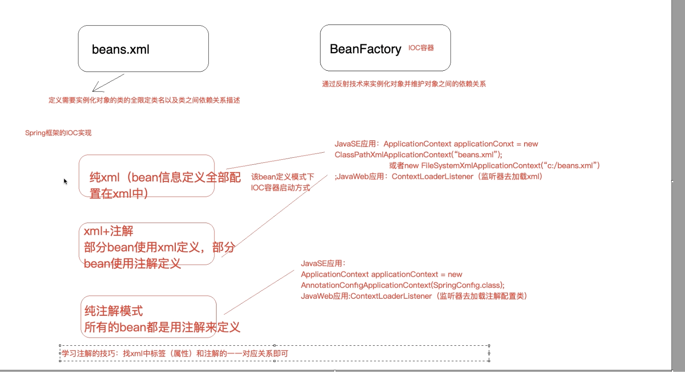

- #+BEGIN_TIP
  这是未经整理的知识
  #+END_TIP
- 问题
	- JDK 9 中 newInstance 显示过时的问题
		- 推荐使用 `clazz.getDeclaredConstructor().newInstance()`
-
-
- 数据库的事务归根结底是 jdbc connection 的事务
- 如果两个 connection ，那肯定不可能控制在同一个事务中，所以如果要给两个操作使用同一个事务，则必须使用同一个 connection，所以这通过同一个线程使用同一个 connection 来解决，也就是把 connection 放在 ThreadLocal 中来解决
-
- {:height 424, :width 766}
- 如何删除 Map 中的数据
	- ```java
	  map.entrySet()
	    .removeIf(item -> item.getKey().equals("name"));
	  ```
	- ```java
	  Iterator<Map.Entry<Integer, String>> it = map.entrySet().iterator();  
	  while(it.hasNext()){  
	    Map.Entry<Integer, String> entry = it.next();  
	    if(entry.getKey() == 2)  
	      // 使用迭代器的remove()方法删除元素
	      // 注意不能使用 map 的 remove 方法
	      it.remove(); 
	  }
	  ```
-
- linux mina 串口连接没有反应
	- 没有添加底层的包，RXTXComm，把相应的包添加就好了
	- 1.`.so` 文件添加到`JAVA_HOME/jre/lib/amd64`
	-
	  2. `RXTXcomm.jar` 添加到 `JAVA_HOME/jre/lib/ext`
	- 包[下载地址](http://rxtx.qbang.org/wiki/index.php/Download)，下载[二进制包](http://rxtx.qbang.org/pub/rxtx/rxtx-2.2pre2-bins.zip)就好了，如果不行再根据源码编译吧😂
-