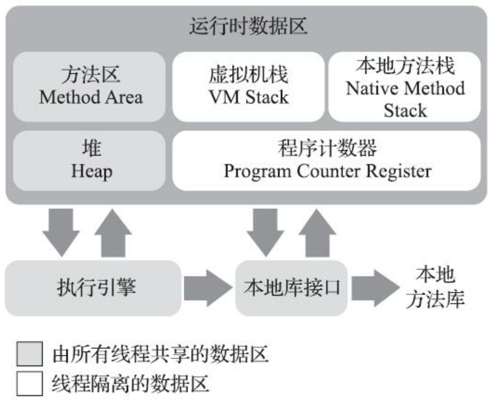

- 运行时数据区域
	- {:height 411, :width 490}
	- 程序计数器
		- 最基本的数据区域，很小的一块内存，用来存储每个线程执行的指令位置，程序就是依靠计数器来指导下一行要执行的指令的位置
		- 如果正在执行本地方法，那计数器的值就是空
		- 本区域没有内存溢出错误
	- 虚拟机栈
		- > 通常所说的栈和堆，其中栈就是指虚拟机栈，或特指虚拟机栈栈帧中的局部变量表
		- 方法执行的栈，每个方法对应栈中的一个栈帧，栈帧中存储着方法的局部变量表，方法出口等信息
		- 局部变量表->局部变量槽
		- 引用类型使用句柄或指针来引用堆中的对象
		- 异常：OOM，stackOverflowError
		- HotSpot 虚拟机是没有栈容量扩展机制的，但是依旧存在 OOM 异常，那就是在进入方法是申请方法栈容量的时候可能申请不到，从而抛出 OOM
	- 本地方法栈
		- 和虚拟机栈类似，用来执行本地方法
		- 异常：OOM，StackOverflowError
	- 堆（GC堆）
		- 堆是线程共享的，用来存储对象实例和数组，不过[[标量替换]]，[[栈上分配]]等编译器优化技术的存在，使对象存储在堆中不再是绝对的
		- GC 管理的内存区域，大多是使用分代技术来管理的，但是也出现了不使用分代技术的GC实现
		- 堆还可以划分出线程私有的分配缓冲区，加快对象分配
		- 堆的大小主流是设计成可扩展的，通过参数 -Xmx 和 -Xms 设定
		- 异常：OOM
	- 方法区（非堆）
		- 线程共享的，用来存储已加载的类型信息、常量、静态变量、即时编译器编译后的代码缓存等数据
		- 曾经 HotSpot 将堆的永久代作为方法区实现（方便统一 GC），但存在容易 OOM，方法在不同虚拟机下表现不统一，虚拟机特性移植困难等问题，于是在 JDK8 中，永久代被彻底废弃，使用本地内存实现的元空间来替代。
		- 不要求要有GC，但是确实是有必要的，否则可能导致内存泄露
		- 异常：OOM
	- 运行时常量池
		- 方法区的一部分，存放编译器生成 class 中的 chang常量池表
		- 运行时常量池相对于Class文件常量池的另外一个重要特征是具备动态性，Java语言并不要求常量一定只有编译期才能产生，也就是说，并非预置入Class文件中常量池的内容才能进入方法区运行时常量池，运行期间也可以将新的常量放入池中，这种特性被开发人员利用得比较多的便是String类的intern()方法。
		- 异常：OOM
	- 直接内存
		- 直接内存（Direct Memory）并不是虚拟机运行时数据区的一部分，也不是《Java虚拟机规范》中定义的内存区域。但是这部分内存也被频繁地使用，而且也可能导致OutOfMemoryError异常出现，所以我们放到这里一起讲解。在JDK 1.4中新加入了`NIO（New Input/Output）类，引入了一种基于通道（Channel）与缓冲区（Buffer）的I/O方式，它可以使用Native函数库直接分配堆外内存，然后通过一个存储在Java堆里面的DirectByteBuffer对象作为这块内存的引用进行操作`。这样能在一些场景中显著提高性能，因为避免了在Java堆和Native堆中来回复制数据。显然，本机直接内存的分配不会受到Java堆大小的限制，但是，既然是内存，则肯定还是会受到本机总内存（包括物理内存、SWAP分区或者分页文件）大小以及处理器寻址空间的限制，一般服务器管理员配置虚拟机参数时，会根据实际内存去设置-Xmx等参数信息，但经常忽略掉直接内存，使得各个内存区域总和大于物理内存限制（包括物理的和操作系统级的限制），从而导致动态扩展时出现OutOfMemoryError异常。