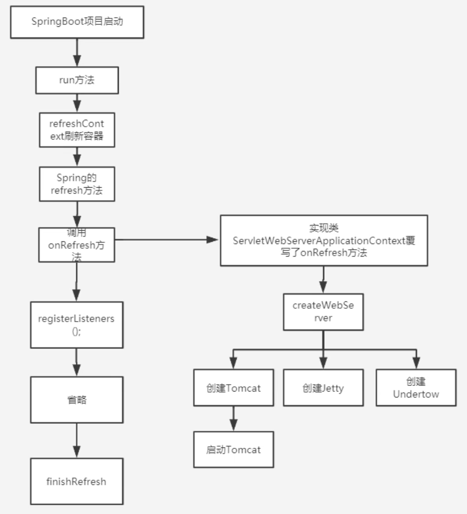

- spring-boot-starter-web 默认引入了 spring-boot-starter-tomcat
- 替换 Tomcat
	- 排除 spring-boot-starter-tomcat 依赖
	- 引入其他的容器，如 [[Jetty]]
		- ```xml
		  <dependency>
		    <groupId>org.springframework.boot</groupId>
		    <artifactId>spring-boot-starter-jetty</artifactId>
		  </dependency>
		  ```
- 自动装配 tomcat
  collapsed:: true
	- 在 spring-boot-autoconfigure 中自动装配了一个 ServletWebServerFactoryAutoConfiguration 类，这就是 tomcat 等的自动装配类
	- 使用 @Import 引入了 `ServletWebServerFactoryConfiguration.EmbeddedTomcat.class`，其中生成了 Bean：TomcatServletWebServerFactory
	- 方法：`org.springframework.boot.web.embedded.tomcat.TomcatServletWebServerFactory#getWebServer` 完成了 Tomcat 实例的创建和启动，该方法会在 SpringBoot 启动的时候被调用
	- SpringBoot 启动的时候调用过程
		- {:height 540, :width 466}
- 自动配置 Spring MVC
	- 依靠 servlet 3.0 规范，不需要 web.xml 配置文件
	- SpringMVC 自动配置类做了什么
	- 什么时候把 Dispatcherservlet 添加到 tomcat 的 servletcontext 中