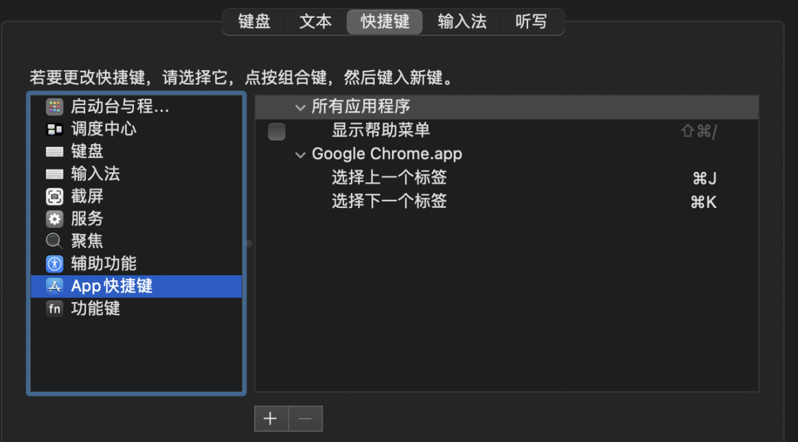

- 说明
  collapsed:: true
	- 快捷键中的字母区分大小写，`大写=⇧+小写`
	- 存在自定义的快捷键
- [[Logseq]] #笔记 #双链笔记
  id:: 616adc9e-9740-4997-abbb-c60fd545e276
	- 本页面搜索 `⌘-f`
	- 全局搜索或创建文件 `⌘-F`
	- 全局指令搜索 `⌘-P`
	- 运行 [[Git]] 命令 `⌘-!`
	- 关闭/显示设置 `t s`
	- 关闭/显示左侧栏 `t l`
	- 折叠/展开所有节点 `t o`
- [[IDEA]] #IED #Java
  collapsed:: true
	- Home  `Fn-←` End  `Fn-→`
	- 文件开头  `⌘-Home(Fn-←)`  文件末尾  `⌘-End(Fn-→)`
	- 翻译  `⌃⌘-u` 翻译并替换  `⌃⌘-o`
	- 重写    `⌃-o`
	- 智能提示  `⌃␣`
	- 选中下一个相同的内容  `⌃-g`
	- 包围代码  `⌘⌥-t`
	- 显示参数信息  `⌘-p`
	- 提取变量  `⌥⌘-v` 提取为方法  `⌥⌘-m`
	- 列编辑  `⇧⌥-leftButton` 多处同时编辑  `⇧⌥⌘-leftButton`
	- 上插一行  `⌥⌘-⏎`  下插一行  `⇧-⏎`
	- 全屏 `⌃⌘-F`
	- 连续选中代码 `⌥-↑`
	- 交换上下行 `⇧⌥-↑` 以方法为单位交换    `⇧⌘-↑`
	- 最近打开的文件 `⌘-e` 点击切换仅修改的文件
	- 打开最近查看过的位置 `⌘-E` 点击切换仅修改的文件
	- 切回上一处鼠标落点 `⌘-[` 切回上一处鼠标落点 `⌘-]`
	- 切到上一个 *tab* 页 `⌘-{` 切到下一个 *tab* 页 `⌘-}`
	- 切到括号末尾（继续按切到外层的括号末尾） `⌥⌘-]` 
	  collapsed:: true
	  切到括号开头（继续按切到外层的括号开头） `⌥⌘-[`
	- 格式化 `⌥⌘-l` 清理导入包 `⌃⌥-o`
	- 开关 *Project* 界面    `⌘-1`
	  collapsed:: true
	  {{embed ((616bd472-f09a-42d8-9766-87dd035b9884))}} 
	  开关 *Run* 界面    `⌘-4`
	  开关 *Debug* 界面    `⌘-5`
	- 查询 URL `⌘-|`，原来需要安装 http request 查看，现在自带了
	- 自定义快捷键
	  collapsed:: true
		- 折叠展开所有文档注释 `⌃--` `⌃-=`
		- 定位当前打开文件(Select in Project View) `⌘-!`
		- 在 *Terminal* 中打开 `⌘-W`
		- Zen(禅模式) `⌃-z`
		- 开关 *数据库* 界面 `⌘-2`
		  id:: 616bd472-f09a-42d8-9766-87dd035b9884
		  collapsed:: true
		  开关 *控制台* 界面 `⌘-3`
- [[Xcode]] #IED #Swift
	- 格式化 `⌃-i`
	- 添加组件 `⌃⌘-l`
	- 修改组件属性 `⌃⌥-leftButton`
	- 编译 `⌘-b`
	- 编译并运行 `⌘-r`
	- [[模拟器]]
		- 屏幕左右旋转 `⌘-::` ``
- [[Bash]]
	- 清除当前命令 `⌃-u`
	- 光标到行首 `⌃-a` 行末 `⌃-e`
	- 从光标处删除至行首 `⌃-u` 行首 `⌃-k`
	- 反向搜索历史命令 `⌃-r`
- [[Mac]] #操作系统 
  collapsed:: true
	- 全屏 `⌃⌘-f`
	- 最小化 `⌘-m`
	- 隐藏 `⌘-h`
	- 关闭当前标签页 `⌘-w`
	- 隐藏所有其他窗口 `⌥⌘-h`
	- 退出应用 `⌘-q`
	- 设置 `⌘-,`
	- 关闭所有窗口 `⌥⌘-w`
	- 创建文件夹 `⌘-N`
	- 打开 *前往文件夹* 窗口 `⌘-G`
	- 锁屏 `⌥⌘-q`
	- 退出账户 `⌘-Q`
	- 直接退出账户 `⌥⌘-Q`
	- 插入新行 `⌃-o`
	- 打开程序坞并聚焦 `⌃-F3`
	- 截图到剪切板 `⌃⌘-$`
	- 截图到桌面 `⌘-$`
	- 全屏截图 `⌘-#`
	- 快速预览 `␣`
	- 对 APP 进行快捷键设定
	  collapsed:: true
		- Mac 中可以对很多 APP 进行快捷键设定
		  collapsed:: true
		  系统设置中选择 APP 快捷键 -> 选择 APP -> 输入菜单名称并定义快捷键
		  {:height 303, :width 510}
- [[Navicat]] #客户端 #数据库
  collapsed:: true
	- 新建查询 `⌘-y`
- [[Terminal]] #客户端 #ssh
  collapsed:: true
	- 清屏 `⌘-k`
	- 打开一个本地 ssh `⌘-l`
- [[Chrome]] #浏览器 #Google 
  id:: 616ae5b0-8595-48e4-826d-df6e07041ce5
  collapsed:: true
	- 刷新 `⌘-r` 清除缓存刷新 `⌘-R`
	- 上一个标签 `⇧⌃-⇥` 下一个标签 `⌃-⇥`
	- 关闭当前标签 `⌘-w` 打开新标签 `⌘-t`
	- 添加书签 `⌘-d`
	- 地址栏搜索 `⌥⌘-f`
	- 界面截图 `⌘-S`
	- 打开 *Console* 栏目  `⌘⌥-j`
	  collapsed:: true
	  打开 *NetWork* 栏目  `⌘⌥-i`
	  打开 *Download* 页面  `⌘-J`
- [[Edge]] #浏览器 #Microsoft 
  collapsed:: true
	- ((616ae5b0-8595-48e4-826d-df6e07041ce5))