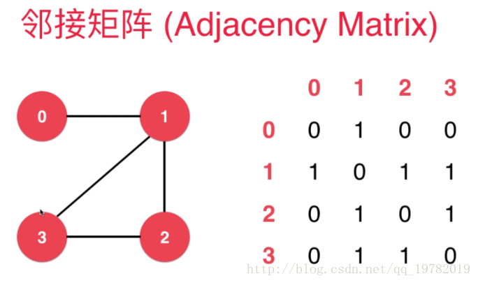
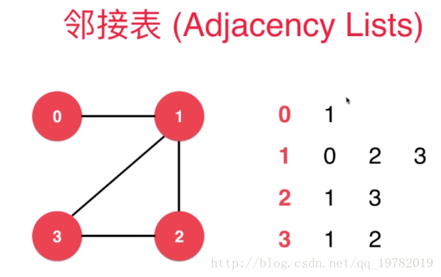
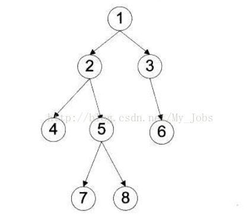
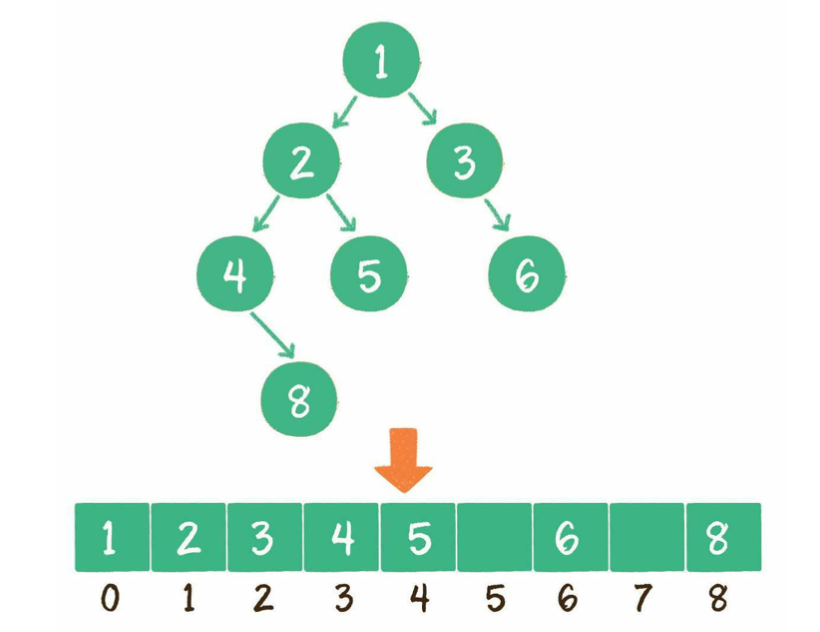

- 物理结构（底层存储结构）：两种，所以所有的逻辑结构一般至少都有两种实现
  collapsed:: true
	- 数组：顺序存储
	- 链表：链式存储
- 逻辑结构
	- 栈：LIFO
	- 队列：FIFO
	- 优先队列：按优先级出队
	- 双端队列：
	- 图
	  collapsed:: true
		- 表示方法
		  collapsed:: true
			- 邻接矩阵法：空间使用多，效率高
				- {:height 212, :width 318}
				- 几个点就是几行几列，[i][j] 表示 i 和 j 之间是否有连接，如 [0][1]=1 表示 0 和 1 有连接
			- 邻接表法：空间使用少，效率低
				- {:height 225, :width 316}
				- 表示每个点和那些点有连接
	- 散列表：Hash
	  collapsed:: true
		- 数组+链表（拉链式），数组+红黑树（数据量大才有优势，至少>8）
		- 冲突解决
			- 链地址法，拉链式解决，冲突的地址放到链中
			- 开放地址法：计算候补地址，可以多次 Hash 或 线性探测法
			- 公共溢出区：将所有冲突的数据放到一个区中
	- 树：特殊的图
	  collapsed:: true
		- 遍历方式：分为广度和深度两个大类，其中深度分为前序，中序，后序三种
		  collapsed:: true
			- {:height 208, :width 223}
			- 广度遍历（层次遍历）
				- 逐层从左到右遍历：1  2  3  4  5  6  7  8
					- 层次遍历的代码比较简单，只需要一个队列即可，先在队列中加入根结点。之后对于任意一个结点来说，在其出队列的时候，访问之。同时如果左孩子和右孩子有不为空的，入队列
			- 深度遍历
				- ```java
				  // 基础框架
				  
				  void traverse(TreeNode root) { 
				  // 前序遍历
				  traverse(root.left)
				  // 中序遍历 
				  traverse(root.right) 
				  // 后序遍历
				  }
				  ```
				- > 这里的 **序** 说的是根节点的位置，左右子节点位置固定先遍历左节点
				- 前序遍历：根左右：1  2  4  5  7  8  3  6
					- ```java
					  public void preOrderTraverse1(TreeNode root) {
					  if (root != null) {
					    System.out.print(root.val+"  ");
					    preOrderTraverse1(root.left);
					    preOrderTraverse1(root.right);
					  }
					  }
					  
					  // 非递归，也就是用栈结构替代递归结构
					  // ...
					  public void preOrderTraverse2(TreeNode root) {
					  LinkedList<TreeNode> stack = new LinkedList<>();
					  TreeNode pNode = root;
					  while (pNode != null || !stack.isEmpty()) {
					    if (pNode != null) {
					      System.out.print(pNode.val+"  ");
					      stack.push(pNode);
					      pNode = pNode.left;
					    } else { //pNode == null && !stack.isEmpty()
					      TreeNode node = stack.pop();
					      pNode = node.right;
					    }
					  }
					  }
					  ```
				- 中序遍历：左根右：4  2  7  5  8  1  3  6
					- ```java
					  public void inOrderTraverse1(TreeNode root) {
					  if (root != null) {
					    inOrderTraverse1(root.left);
					    System.out.print(root.val+"  ");
					    inOrderTraverse1(root.right);
					  }
					  }
					  
					  // 非递归，也就是用栈结构替代递归结构
					  // ...
					  public void preOrderTraverse2(TreeNode root) {
					  LinkedList<TreeNode> stack = new LinkedList<>();
					  TreeNode pNode = root;
					  while (pNode != null || !stack.isEmpty()) {
					    if (pNode != null) {
					      stack.push(pNode);
					      pNode = pNode.left;
					    } else { //pNode == null && !stack.isEmpty()
					      TreeNode node = stack.pop();
					      System.out.print(node.val+"  ");
					      pNode = node.right;
					    }
					  }
					  }
					  ```
				- 后序遍历：左右根：4  7  8  5  2  6  3  1
					- ```java
					  public void postOrderTraverse1(TreeNode root) {
					  if (root != null) {
					    postOrderTraverse1(root.left);
					    postOrderTraverse1(root.right);
					    System.out.print(root.val+"  ");
					  }
					  }
					  
					  // 非递归，也就是用栈结构替代递归结构
					  // 后序遍历可以取巧的方式，
					  // 用第二个栈来存储一个 对称的前序遍历（中右左），
					  // 再弹出就是后序了
					  ```
			-
		- 一些特殊的树
		  collapsed:: true
			- 完全二叉树
			- 满二叉树
			- 二叉搜索树 BST
			- 平衡树
				- 平衡二叉搜索树 AVL
				- B树（B-树），B+树，B*树
			- 弱平衡树
				- 红黑树 RBT
				- 树堆 Treap
		- 存储方式
			- 数组：需要存储成完全二叉树，才能还原
				- {:height 253, :width 314}
				- 子节点容易找父节点：子节点下标为 m，则父节点下标为：$(m-1)\div 2$
				- 父节点容易找子节点：父节点下标为 n，则右子节点下标为：$2\times n+2$
				- > 如果树很稀疏，很浪费空间，但是堆很合适，因为堆就是一颗完全二叉树，完全放满
			- 链表：很简单
	- 堆：特殊的树：完全二叉树
		- 一般使用数组存储
		- 堆的分类：最小堆，最大堆
		- 堆的平衡
		  collapsed:: true
			- 添加元素：`O(logn)`
				- 添加到尾都，逐个比较上浮
			- 删除元素（删除头）：`O(logn)`
				- 将尾部元素放到空出的头部，然后逐个比较下沉
			- 构建二叉堆（把一个无序的完全二叉树调整为二叉堆）：`O(n)`
				- 让所有非叶子结点比较下沉
		- 作用
			- 优先队列
				- ((61a8f64c-b49d-456a-935a-c5f8447adad0))
			- 堆排序
		-