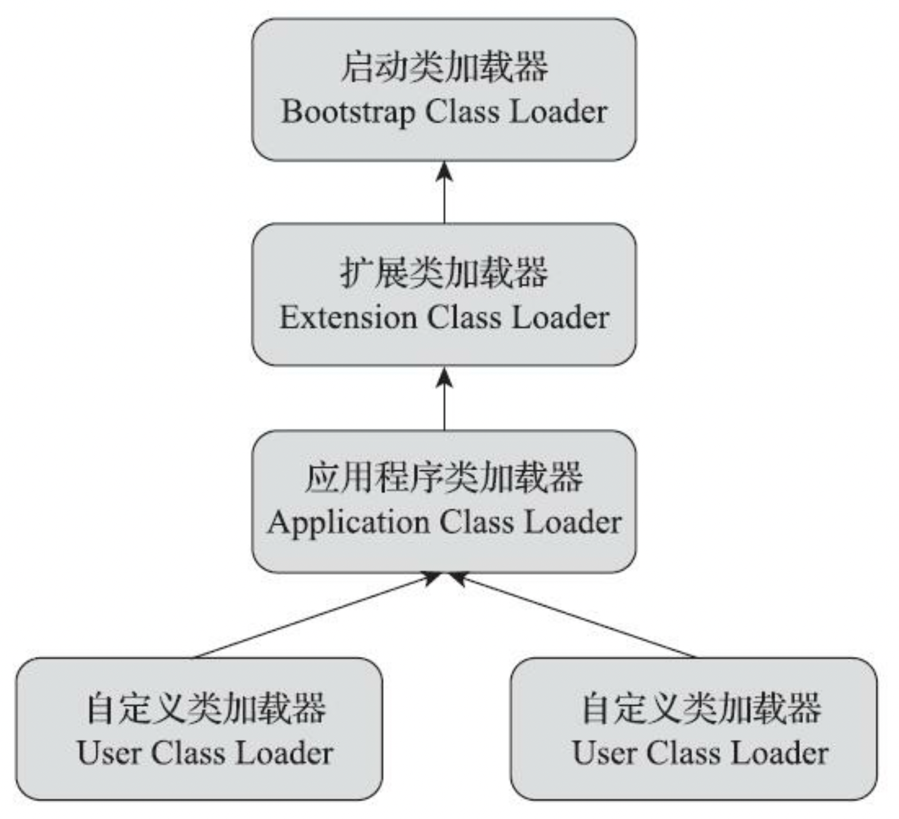

- 对于任意一个类，都必须由加载它的类加载器和这个类本身一起共同确立其在Java虚拟机中的唯一性，每一个类加载器，都拥有一个独立的类名称空间
- ```java
  @Test
  public void aTst2() throws ClassNotFoundException, InstantiationException, IllegalAccessException {
    ClassLoader myLoader =
      new ClassLoader() {
      @Override
      public Class<?> loadClass(String name) throws ClassNotFoundException {
        try {
          String fileName = name.substring(name.lastIndexOf(".") + 1) + ".class";
          InputStream is = getClass().getResourceAsStream(fileName);
          if (is == null) {
            return super.loadClass(name);
          }
          byte[] b = new byte[is.available()];
          is.read(b);
          return defineClass(name, b, 0, b.length);
        } catch (IOException e) {
          throw new ClassNotFoundException(name);
        }
      }
    };
    Object obj = myLoader.loadClass("top.maoyilan.studyproject.StudyProjectApplicationTests").newInstance();
  
    System.out.println(obj.getClass());
    // class top.maoyilan.studyproject.StudyProjectApplicationTests
    System.out.println(obj instanceof top.maoyilan.studyproject.StudyProjectApplicationTests);
    // false
  }
  ```
-
- 双亲委派模型
	- {:height 289, :width 306}
	- 三个默认的加载器
	  collapsed:: true
		- 启动类加载器
			- `obj.getClass().getClassLoader()` 返回 null 表示该类由 Bootstrap Class Loader 加载
			- 负责加载存放在 `<JAVA_HOME>\lib`目录，或者被`-Xbootclasspath`参数所指定的路径中存放的，而且是Java虚拟机能够 识别的(按照文件名识别，如rt .jar、t ools.jar，名字不符合的类库即使放在lib目录中也不会被加载)类 库加载到虚拟机的内存中
			- 启动类加载器无法被Java程序直接引用，用户在编写自定义类加载器时，如果需要把加载请求委派给引导类加载器去处理，那直接使用null代替即可，代码清单7-9展示的就是java.lang.ClassLoader.getClassLoader() 方法的代码片段，其中的注释和代码实现都明确地说明了以null值来代表引导类加载器的约定规则
		- 扩展类加载器 `sun.misc.Launcher$ExtClassLoader`
			- 负责加载`<JAVA_HOM E>\lib\ext`目录中，或者被`java.ext.dirs`系统变量所指定的路径中所有的类库。
		- 应用程序类加载器 `sun.misc.Launcher$AppClassLoader`
			- 是ClassLoader类中的getSystemClassLoader()方法的返回值，所以有些场合中也称它为“系统类加载器”。它负责加载用户类路径 (ClassPath)上所有的类库，开发者同样可以直接在代码中使用这个类加载器。如果应用程序中没有 自定义过自己的类加载器，一般情况下这个就是程序中默认的类加载器。
	- 这里类加载器之间的父子关系一般不是以继承(Inherit ance)的关系来实现的，而是通常使用 组合(Composition)关系来复用父加载器的代码。
	- 工作过程
		- 如果一个类加载器收到了类加载的请求，它首先不会自己去尝试加
		  载这个类，而是把这个请求委派给父类加载器去完成，每一个层次的类加载器都是如此，因此所有的
		  加载请求最终都应该传送到最顶层的启动类加载器中，只有当父加载器反馈自己无法完成这个加载请
		  求(它的搜索范围中没有找到所需的类)时，子加载器才会尝试自己去完成加载。
	- 好处
		- 防止出现多个同名类，防止同名覆盖系统类
		- 即使自定义了自己的类加载器，强行用defineClass()方法去加载一个以“java.lang”开头的类也不会成功。如果读者尝试这样做的话，将会收到一个由Java虚拟机内部抛出的`java.lang.SecurityException:Prohibitedpackagename:java.lang`异常。
	- 逻辑实现
		- ```java
		  protected Class<?> loadClass(String name, boolean resolve)
		    throws ClassNotFoundException
		      {
		         synchronized (getClassLoadingLock(name)) {
		             // First, check if the class has already been loaded
		             Class<?> c = findLoadedClass(name);
		             if (c == null) {
		                 long t0 = System.nanoTime();
		                 try {
		                     if (parent != null) {
		                         c = parent.loadClass(name, false);
		                     } else {
		                         c = findBootstrapClassOrNull(name);
		                     }
		                 } catch (ClassNotFoundException e) {
		                     // ClassNotFoundException thrown if class not found
		                     // from the non-null parent class loader
		                 }
		  
		                 if (c == null) {
		                     // If still not found, then invoke findClass in order
		                     // to find the class.
		                     long t1 = System.nanoTime();
		                     c = findClass(name);
		  
		                     // this is the defining class loader; record the stats
		                     PerfCounter.getParentDelegationTime().addTime(t1 - t0);
		                     PerfCounter.getFindClassTime().addElapsedTimeFrom(t1);
		                     PerfCounter.getFindClasses().increment();
		                 }
		             }
		             if (resolve) {
		                 resolveClass(c);
		             }
		             return c;
		         }
		      }
		  ```
- 3 个破坏双亲委派模型
	- 为了兼容旧版JDK（<1.2，还未出现双亲委派模型），无法避免 loadClass 被覆盖，所以只能添加 findClass 方法，鼓励用户覆盖 findClass，而不覆盖 loadClass，因为双亲委派实现就是 loadClass中实现的，一旦覆盖，就破坏了
	- 由模型的自身缺陷引起，当基本类依赖于用户自定义的类时，无法使用双亲委派的机制来进行加载类，
	  如 jdbc
	  jdbc 的接口是 java 的基本类，但是实现是用户提供的，这就导致启动类加载器无法加载具体实现，只能提供了一个上下文加载器去加载具体实现，这就违反了双亲委派，而是由父类加载器去请求子类加载器加载类
	- 由于用户对程序动态性的追求而导致的，如热更新，热部署等，
	  OGSI ：Java 模块化，Tomcat：模块化
	  OSGi实现模块化热部署的关键是它自定义的类加载器机制的实现，每一个程序模块(OSGi中称为 Bundle)都有一个自己的类加载器，当需要更换一个Bundle时，就把Bundle连同类加载器一起换掉以实 现代码的热替换。在OSGi环境下，类加载器不再双亲委派模型推荐的树状结构，而是进一步发展为更 加复杂的网状结构